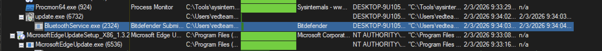
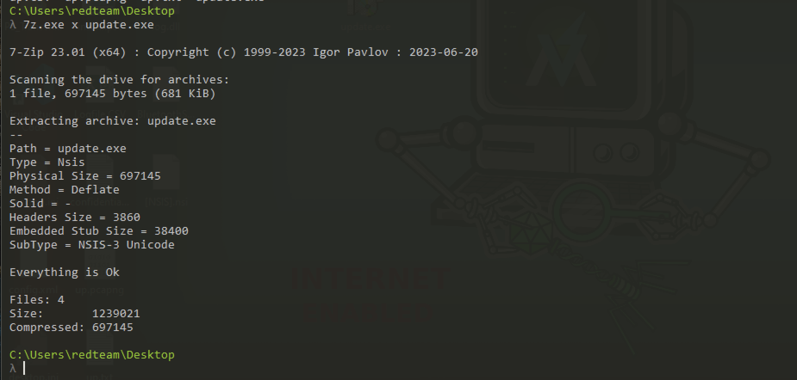

# Notepad++

## **Executive Summary**

The update.exe binary is a **malicious NSIS (Nullsoft Scriptable Install System) installer** disguised as a legitimate update executable. 

This is consistent with the **Chrysalis backdoor** used by the **Lotus Blossom APT  group**. The malware uses a legitimate installer 

framework to deploy malicious payloads while appearing benign, specifically targeting systems with Notepad++ installations for DLL 

hijacking attacks. 

---

## Artifacts

| **File name**  | **sha256** | **Description** |
| --- | --- | --- |
| **update.exe** | **`a511be5164dc1122fb5a7daa3eef9467e43d8458425b15a640235796006590c9`** | **NSIS-based dropper for Chrysalis backdoor** |
| **[NSIS].nsi** | **`8ea8b83645fba6e23d48075a0d3fc73ad2ba515b4536710cda4f1f232718f53e`**  | NSIS Installation script |
| **BluetoothService.exe** | **`2da00de67720f5f13b17e9d985fe70f10f153da60c9ab1086fe58f069a156924`** | used for dll sideloading |
| **BluetoothService** | **`77bfea78def679aa1117f569a35e8fd1542df21f7e00e27f192c907e61d63a2e`** | Encrypted shellcode |
| **log.dll** | **`3bdc4c0637591533f1d4198a72a33426c01f69bd2e15ceee547866f65e26b7ad`** | Malicious DLL sideloaded by BluetoothService.exe |

---

## **Analysis of update.exe**

---

| **Property** | **Value** |
| --- | --- |
| **File Name** | **`update.exe`** |
| **MD5** | `869b85d8004b64fbef4d4ae9d4b20f00` |
| **SHA-1** | `d7ffd7b588880cf61b603346a3557e7cce648c93` |
| **SHA-256** | `a511be5164dc1122fb5a7daa3eef9467e43d8458425b15a640235796006590c9` |
| **Vhash** | `065056655d1c0550c043z800417z57z52z4gz` |
| **Authentihash** | `10f61547d126f9952156ed945824c6863715c00a8ede294e81c5a054da9fcbfe` |
| **Imphash** | `573bb7b41bc641bd95c0f5eec13c233b` |
| **Rich PE Header Hash** | `ea665d1587c4e6a30af5ae0282aa3786` |
| **SSDEEP** | `12288:TTAe5oCEIBor8PrGzs1Rd/eD27KTHaTjSFuUKRD5Rvdpb08bWisBP9xuNDZKn00g:TTAeuNRrMWsTxq278HaTWMx3RvdJ08yc` |
| **TLSH** | `T119E423255AB1C035C766233F2DB23367DBF680252ACC552743243FFA74966E7228FA94` |
| **File Type** | Win32 EXE (Windows PE) |
| **Magic** | PE32 executable (GUI) Intel 80386, MS Windows, **Nullsoft Installer** self-extracting archive |
| **TrID** | Win32 Executable MS Visual C++ (47.3%), Win64 Executable (15.9%), Win32 DLL (9.9%) |
| **DetectItEasy** | **Installer:** NSIS (3.11) [zlib,solid]; **Compiler:** MSVC (12.20.9044); **Linker:** MS Linker (6.0) |
| **Magika** | PEBIN |
| **File Size** | 680.81 KB (697,145 bytes) |

### PE section

| **Property** | **.text** | **.rdata** | **.data** | **.ndata** | **.rsrc** |
| --- | --- | --- | --- | --- | --- |
| **SHA-256 Hash** | `787C8BD338CC402B56AEF79522566487FDABE71002273F1D61CE33D95A2169F0` | `24F50A92DF2985FBE4E63FDB8AA01B8822DC5B9249ACA403AC13EF300BD19429` | `BF0018EE8238EC05803110C1D17310D37416BF72548B9912C00F5CECC209D7D0` | `n/a` | `E185F0A6AB6E2701D49DCB8763DBB4C68DF3EEE63F10614CE5DA69A8587FF277` |
| **Entropy** | 6.489 | 4.971 | 4.174 | `n/a` | 4.605 |
| **File Ratio** | 3.89% | 0.81% | 0.22% | `n/a` | 0.44% |
| **Raw Address (Begin)** | `0x00000400` | `0x00006E00` | `0x00008400` | `0x00000000` | `0x00008A00` |
| **Raw Size** | 27,136 B | 5,632 B | 1,536 B | 0 B | 3,072 B |
| **Virtual Address** | `0x00001000` | `0x00008000` | `0x0000A000` | `0x00035000` | `0x00045000` |
| **Virtual Size** | 26,931 B | 5,220 B | **174,104 B** | **65,536 B** | 2,872 B |

| **Section Name** | **Virtual Size (Memory)** | **Raw Size (Disk)** | **Entropy** | **Role in the Infection Chain** |
| --- | --- | --- | --- | --- |
| **`.text`** | 26,931 B | 27,136 B | **6.49** | **Execution Engine:** Contains the assembly instructions for the loader. High entropy suggests obfuscated code or an unpacking stub. |
| **`.rdata`** | 5,220 B | 5,632 B | 4.97 | **Reference Library:** Stores constants and the Import Address Table (IAT) identifying APIs like `CreateFileW`. |
| **`.data`** | **174,104 B** | 1,536 B | 4.17 | **Landing Zone:** Exhibits massive memory expansion (113x). Carves out RAM to host the decrypted `log.dll` or shellcode. |
| **`.ndata`** | 65,536 B | **0 B** | **0.00** | **Ghost Section:** Does not exist on disk. Used as a zero-initialized "scratchpad" for writing dynamic instructions during unpacking. |
| **`.rsrc`** | 2,872 B | 3,072 B | 4.60 | **UI/Manifest:** Standard resources. Low entropy confirms the 600KB+ main payload is stored in the **Overlay**, not here. |

### Linked Libraries

| **Library** | **Type** | **Import Count** | **Description** |
| --- | --- | --- | --- |
| **KERNEL32.dll** | Implicit | 65 | **Core OS:** Base API for memory management, file I/O, and process handling. |
| **USER32.dll** | Implicit | 64 | **GUI/Input:** Manages windows, menus, and user interaction. |
| **ADVAPI32.dll** | Implicit | 12 | **Security:** Provides access to the Registry and Service/Token management. |
| **GDI32.dll** | Implicit | 8 | **Graphics:** Device interface for rendering text and basic shapes. |
| **SHELL32.dll** | Implicit | 5 | **Shell:** High-level OS functions (file operations, shell execution). |
| **ole32.dll** | Implicit | 5 | **COM/OLE:** Used for Object Linking and Embedding (common for COM hijacking). |
| **COMCTL32.dll** | Implicit | 4 | **UI Controls:** Common controls like progress bars and buttons. |

### IMPORTS

| **Library** | **Function** | **Offset** | **Purpose / Risk** |
| --- | --- | --- | --- |
| **ADVAPI32.dll** | `AdjustTokenPrivileges`, `OpenProcessToken` | `0x89C4` | **Privilege Escalation:** Used to gain admin/system rights. |
|  | `RegSetValueExW`, `RegCreateKeyExW` | `0x8982` | **Persistence:** Writing to "Run" keys to start on boot. |
| **KERNEL32.dll** | `CreateProcessW`, `CreateThread` | `0x9368` | **Execution:** Launching secondary payloads or shellcode. |
|  | `WriteFile`, `CreateFileW`, `DeleteFileW` | `0x93BC` | **File I/O:** Dropping malicious DLLs or cleaning up tracks. |
|  | `GetProcAddress`, `LoadLibraryExW` | `0x9404` | **Evasion:** Manually loading DLLs to hide from static analysis. |
|  | `WaitForSingleObject` | `0x9440` | **Sync:** Waiting for a dropped process to finish its task. |
| **USER32.dll** | `SetClipboardData`, `OpenClipboard` | `0x8E64` | **Stealing:** Possible credential/data theft from clipboard. |
|  | `FindWindowExW`, `SendMessageW` | `0x8C2A` | **Interaction:** Searching for and controlling other windows. |
| **SHELL32.dll** | `ShellExecuteExW`, `SHFileOperationW` | `0x8A8C` | **Operations:** Executing commands or moving large batches of files. |
| **OLE32.dll** | `CoCreateInstance` | `0x8ACA` | **COM Hijacking:** Common technique for persistence or bypassing UAC. |

---

## **Entry Point Analysis (0x0040358d)**

---

### GHIDRA decompilation

This Ghidra decompilation is the **entry point stub** for a Nullsoft Scriptable Install System (NSIS) executable. In the context of the **Chrysalis Backdoor**, this code serves as the **Stage 1 Loader**. Its primary goal is to prepare the environment, bypass basic security checks, and extract the malicious payload to a hidden temporary directory.

```c
/* WARNING: Globals starting with '_' overlap smaller symbols at the same address */

void entry(void)

{
  ushort uVar1;
  bool bVar2;
  BOOL BVar3;
  FARPROC pFVar4;
  int iVar5;
  LPWSTR pWVar6;
  short *psVar7;
  LPCWSTR pWVar8;
  WCHAR *pWVar9;
  int *piVar10;
  undefined3 extraout_var;
  undefined *puVar11;
  HANDLE pvVar12;
  WCHAR *pWVar13;
  char *lpString;
  WCHAR WVar14;
  DWORD DVar15;
  HANDLE *TokenHandle;
  int iStack_3f8;
  uint local_3f4;
  wchar_t *local_3f0;
  UINT local_3e8;
  HANDLE pvStack_3e4;
  _TOKEN_PRIVILEGES _Stack_3e0;
  _OSVERSIONINFOW _Stack_3d0;
  uint uStack_2bc;
  undefined4 uStack_2b8;
  SHFILEINFOW SStack_2b4;
  
  local_3e8 = 0;
  local_3f0 = u_Error_writing_temporary_file._Ma_0040a2d8;
  local_3f4 = 0;
  SetErrorMode(0x8001);
  _Stack_3d0.szCSDVersion[0] = L'\0';
  _Stack_3d0.szCSDVersion[1] = L'\0';
  uStack_2bc = 0;
  uStack_2b8 = 0;
  _Stack_3d0.dwOSVersionInfoSize = 0x11c;
  BVar3 = GetVersionExW(&_Stack_3d0);
  if (BVar3 == 0) {
    _Stack_3d0.dwOSVersionInfoSize = 0x114;
    GetVersionExW(&_Stack_3d0);
    uStack_2b8._0_3_ = CONCAT12(4,(undefined2)uStack_2b8);
    uStack_2bc = CONCAT22(uStack_2bc._2_2_,
                          ~-(ushort)(_Stack_3d0.szCSDVersion[0] != L'S') &
                          _Stack_3d0.szCSDVersion[0xd] + L'￐');
  }
  if (_Stack_3d0.dwMajorVersion < 10) {
    _Stack_3d0.dwBuildNumber = _Stack_3d0.dwBuildNumber & 0xffff;
  }
  _DAT_004347b8 = _Stack_3d0.dwBuildNumber;
  _DAT_004347bc =
       (uint)CONCAT11((undefined1)_Stack_3d0.dwMajorVersion,(undefined1)_Stack_3d0.dwMinorVersion)
       << 0x10 | (uStack_2bc & 0xff) << 8 | uStack_2b8 >> 0x10 & 0xff;
  if ((CONCAT11((undefined1)_Stack_3d0.dwMajorVersion,(undefined1)_Stack_3d0.dwMinorVersion) !=
       0x600) && (pFVar4 = FUN_004069a6(0), pFVar4 != (FARPROC)0x0)) {
    (*pFVar4)(0xc00);
  }
  lpString = "UXTHEME";
  do {
    FUN_00406936(lpString);
    iVar5 = lstrlenA(lpString);
    lpString = lpString + iVar5 + 1;
  } while (*lpString != '\0');
  FUN_004069a6(0xc);
  DAT_00434704 = FUN_004069a6(10);
  pFVar4 = FUN_004069a6(8);
  if ((pFVar4 != (FARPROC)0x0) && (iVar5 = (*pFVar4)(0x1e), iVar5 != 0)) {
    _DAT_004347bc = _DAT_004347bc | 0x80;
  }
  Ordinal_17();
  DAT_004347c0 = OleInitialize((LPVOID)0x0);
  SHGetFileInfoW((LPCWSTR)&DAT_0042aa28,0,&SStack_2b4,0x2b4,0);
  FUN_004065b2((LPWSTR)&DAT_00433700,u_NSIS_Error_0040a2bc);
  pWVar6 = GetCommandLineW();
  FUN_004065b2(&DAT_0043f000,pWVar6);
  DAT_00434700 = 0x400000;
  psVar7 = &DAT_0043f000;
  WVar14 = L' ';
  if (DAT_0043f000 == 0x22) {
    psVar7 = (short *)&DAT_0043f002;
    WVar14 = L'\"';
  }
  pWVar8 = (LPCWSTR)FUN_00405eae(psVar7,WVar14);
  pWVar6 = CharNextW(pWVar8);
  pWVar9 = pWVar6;
  while( true ) {
    WVar14 = *pWVar9;
    if (WVar14 == L'\0') break;
    while (WVar14 == L' ') {
      pWVar9 = pWVar9 + 1;
      WVar14 = *pWVar9;
    }
    iStack_3f8._0_2_ = L' ';
    if (*pWVar9 == L'\"') {
      pWVar9 = pWVar9 + 1;
      iStack_3f8._0_2_ = L'\"';
    }
    pWVar13 = pWVar9;
    if (*pWVar9 == L'/') {
      pWVar13 = pWVar9 + 1;
      if ((*pWVar13 == L'S') && ((pWVar9[2] == L' ' || (pWVar9[2] == L'\0')))) {
        DAT_004347a0 = 1;
      }
      if (((*(int *)pWVar13 == CONCAT22(DAT_0040a2b2,DAT_0040a2b0)) &&
          (*(uint *)(pWVar9 + 3) == (CONCAT22(DAT_0040a2b6,DAT_0040a2b4) | (int)DAT_0040a2b2 >> 0xf)
          )) && ((pWVar9[5] == L' ' || (pWVar9[5] == L'\0')))) {
        local_3f4 = 4;
      }
      if ((*(int *)(pWVar9 + -1) == CONCAT22(DAT_0040a2a6,DAT_0040a2a4)) &&
         (*(uint *)pWVar13 == (CONCAT22(DAT_0040a2aa,DAT_0040a2a8) | (int)DAT_0040a2a6 >> 0xf))) {
        pWVar9[-1] = L'\0';
        FUN_004065b2(&DAT_0043f800,pWVar9 + 3);
        break;
      }
    }
    pWVar9 = (WCHAR *)FUN_00405eae(pWVar13,(WCHAR)iStack_3f8);
    if (*pWVar9 == L'\"') {
      pWVar9 = pWVar9 + 1;
    }
  }
  GetTempPathW(0x400,(LPWSTR)&DAT_00441800);
  iVar5 = FUN_0040355c();
  if (iVar5 == 0) {
    GetWindowsDirectoryW((LPWSTR)&DAT_00441800,0x3fb);
    lstrcatW((LPWSTR)&DAT_00441800,u_\Temp_0040a298);
    iVar5 = FUN_0040355c();
    if (iVar5 == 0) {
      GetTempPathW(0x3fc,(LPWSTR)&DAT_00441800);
      lstrcatW((LPWSTR)&DAT_00441800,(LPCWSTR)&DAT_0040a290);
      SetEnvironmentVariableW(u_TEMP_0040a284,(LPCWSTR)&DAT_00441800);
      SetEnvironmentVariableW((LPCWSTR)&DAT_0040a27c,(LPCWSTR)&DAT_00441800);
      iVar5 = FUN_0040355c();
      if (iVar5 == 0) goto LAB_00403ad8;
    }
  }
  DeleteFileW((LPCWSTR)&DAT_00441000);
  local_3f0 = FUN_004030a9(local_3f4);
  if (local_3f0 != (wchar_t *)0x0) goto LAB_00403ad8;
  if (DAT_0043471c != 0) {
    piVar10 = (int *)FUN_00405eae(&DAT_0043f000,L'\0');
    if ((int *)0x43efff < piVar10) {
      do {
        if ((*piVar10 == CONCAT22(DAT_0040a272,DAT_0040a270)) &&
           (piVar10[1] == (CONCAT22(DAT_0040a276,DAT_0040a274) | (int)DAT_0040a272 >> 0xf))) break;
        piVar10 = (int *)((int)piVar10 + -2);
      } while ((int *)0x43efff < piVar10);
    }
    local_3f0 = u_Error_launching_installer_0040a1e8;
    if (piVar10 < &DAT_0043f000) {
      pvStack_3e4 = (HANDLE)FUN_00405b7d();
      iVar5 = lstrlenW((LPCWSTR)&DAT_00441800);
      FUN_004065b2((LPWSTR)&DAT_00435000,pWVar6);
      if (DAT_0043f800 == 0) {
        FUN_004065b2(&DAT_0043f800,(LPCWSTR)&DAT_00440800);
      }
      uVar1 = 1;
      do {
        iStack_3f8 = 0;
        do {
          while( true ) {
            wsprintfW((LPWSTR)(&DAT_00441800 + iVar5 * 2),u_~nsu%X.tmp_0040a258,(uint)uVar1);
            FUN_004065ef((LPWSTR)&DAT_00437800,*(int *)(DAT_00434710 + 0x120));
            if (pvStack_3e4 == (HANDLE)0x0) {
              DVar15 = FUN_00405b60((LPCWSTR)&DAT_00441800);
            }
            else {
              DVar15 = FUN_00405b06((LPCWSTR)&DAT_00441800);
            }
            if (DVar15 != 0) break;
            SetCurrentDirectoryW((LPCWSTR)&DAT_00441800);
            FUN_00406372((LPCWSTR)&DAT_00441800,(LPCWSTR)0x0);
            BVar3 = CopyFileW((LPCWSTR)&DAT_00442800,(LPCWSTR)&DAT_00437800,1);
            if (BVar3 == 0) goto LAB_00403ad8;
            FUN_00406372((LPCWSTR)&DAT_00437800,(LPCWSTR)0x0);
            FUN_004065ef((LPWSTR)&DAT_00438000,*(int *)(DAT_00434710 + 0x124));
            pvVar12 = FUN_00405b95((LPWSTR)&DAT_00438000);
            if (pvVar12 != (HANDLE)0x0) {
              CloseHandle(pvVar12);
              local_3f0 = (wchar_t *)0x0;
              goto LAB_00403ad8;
            }
            if ((iStack_3f8 != 0) ||
               (puVar11 = FUN_0040690f((LPCWSTR)&DAT_00437800), iStack_3f8 = iStack_3f8 + 1,
               puVar11 != (undefined *)0x0)) goto LAB_00403ad8;
          }
          DVar15 = GetFileAttributesW((LPCWSTR)&DAT_00437800);
          if (((DVar15 & 0x400) != 0) || (BVar3 = DeleteFileW((LPCWSTR)&DAT_00437800), BVar3 == 0))
          break;
          FUN_00405cbe((LPCWSTR)&DAT_00441800,1);
          bVar2 = iStack_3f8 == 0;
          iStack_3f8 = iStack_3f8 + 1;
        } while (bVar2);
        uVar1 = uVar1 + 1;
      } while (uVar1 != 0);
      goto LAB_00403ad8;
    }
    *(undefined2 *)piVar10 = 0;
    pWVar8 = (LPCWSTR)(piVar10 + 2);
    bVar2 = FUN_00405f89(pWVar8);
    if (CONCAT31(extraout_var,bVar2) == 0) goto LAB_00403ad8;
    FUN_004065b2(&DAT_0043f800,pWVar8);
    FUN_004065b2((LPWSTR)&DAT_00440000,pWVar8);
    local_3f0 = (wchar_t *)0x0;
  }
  DAT_004347ac = -1;
  local_3e8 = FUN_00403c84();
LAB_00403ad8:
  FUN_00403baa();
  OleUninitialize();
  if (local_3f0 != (wchar_t *)0x0) {
    FUN_00405c12(local_3f0,0x200010);
                    /* WARNING: Subroutine does not return */
    ExitProcess(2);
  }
  if (DAT_00434794 != 0) {
    TokenHandle = &pvStack_3e4;
    DVar15 = 0x28;
    pvVar12 = GetCurrentProcess();
    BVar3 = OpenProcessToken(pvVar12,DVar15,TokenHandle);
    if (BVar3 != 0) {
      LookupPrivilegeValueW
                ((LPCWSTR)0x0,u_SeShutdownPrivilege_0040a230,&_Stack_3e0.Privileges[0].Luid);
      _Stack_3e0.PrivilegeCount = 1;
      _Stack_3e0.Privileges[0].Attributes = 2;
      AdjustTokenPrivileges(pvStack_3e4,0,&_Stack_3e0,0,(PTOKEN_PRIVILEGES)0x0,(PDWORD)0x0);
    }
    pFVar4 = FUN_004069a6(4);
    if (((pFVar4 != (FARPROC)0x0) && (iVar5 = (*pFVar4)(0,0,0,0x25,0x80040002), iVar5 == 0)) ||
       (BVar3 = ExitWindowsEx(2,0x80040002), BVar3 == 0)) {
      FUN_0040140b(9);
    }
  }
  if (DAT_004347ac != -1) {
    local_3e8 = DAT_004347ac;
  }
                    /* WARNING: Subroutine does not return */
  ExitProcess(local_3e8);
}
```

---

## **Function Overview**

This is the main entry point of the malicious NSIS installer. It orchestrates the entire infection chain from initialization to payload deployment.

---

**1. Initialization & OS Detection (`0040358d` - `0040367b`)**

```nasm
0040358d: SUB ESP,0x3f8           ; Allocate large stack frame
00403596: PUSH 0x8001
004035a0: CALL SetErrorMode       ; Disable critical error dialogs
```

- **Version Detection**: Uses **`GetVersionExW`** to determine Windows version
- **Compatibility Flags**: Sets flags based on OS version (Win9x vs NT)
- **DLL Preloading**: Loads UXTHEME, USERENV, SETUPAPI, APPHELP, PROPSYS, CRYPTBASE, OLEACC, NTMARTA

```nasm
00403680: MOV ESI,0x4082a8        ; String table start
00403680: CALL LoadLibraryExW     ; Load each DLL in loop
```

---

**2. Command Line Parsing (`00403705` - `0040385f`)**

```nasm
004036ff: CALL GetCommandLineW
0040370a: PUSH EBX                ; Command line buffer
0040370b: CALL lstrcpyW
```

**Parsed Arguments:**

- **`/S`** → Silent mode (**`DAT_004347a0 = 1`**)
- **`/NCRC`** → Skip CRC integrity check
- **`/D=path`** → Custom install directory

```nasm
00403773: CMP word ptr [ECX],0x2f ; Check for '/' switch
00403787: MOV dword ptr [0x004347a0],0x1  ; Set silent mode
```

---

**3. Temp Directory Creation (`00403865` - `004038d1`)**

```nasm
00403865: PUSH ESI                ; Buffer 0x441800
0040386b: PUSH 0x400
00403870: CALL GetTempPathW       ; Get %TEMP% path
00403872: CALL FUN_0040355c       ; Validate/create temp dir
```

**Fallback Logic:**

1. Try **`%TEMP%`**
2. Fallback to **`Windows\Temp`**
3. Create custom temp with **`SetEnvironmentVariableW`**

---

**4. Integrity Verification (`004038e0` - `004038eb`)**

```nasm
004038dc: PUSH dword ptr [ESP + 0x14]  ; CRC check flag
004038e0: CALL FUN_004030a9       ; Verify installer integrity
004038e5: CMP EAX,EBP             ; Check if failed
004038eb: JNZ error_handler       ; Jump to error if failed
```

**Key Check**: If CRC check fails, displays error:

> *"Installer integrity check has failed. Common causes include incomplete download and damaged media..."*
> 

---

**5. Self-Extraction Logic (`004038f1` - `00403ad8`)**

If integrity passes, extracts payload:

```nasm
004039a5: CALL FUN_00405b7d       ; Check if admin/elevated
004039dc: PUSH EBP
004039dd: PUSH 0x40a258           ; Format string "~nsu%X.tmp"
004039e8: CALL wsprintfW          ; Generate temp filename
00403a02: CALL CreateDirectoryW   ; Create extraction directory
00403a89: CALL CopyFileW          ; Copy self to temp
00403ab3: CALL CreateProcessW     ; Execute extracted payload
```

---

**6. Cleanup & Exit (`00403ad8` - `00403ba4`)**

```nasm
00403ad8: CALL FUN_00403baa       ; Cleanup resources
00403add: CALL OleUninitialize    ; COM cleanup
00403ae3: CMP dword ptr [ESP + 0x18],EBP
00403ae7: JZ exit_normal
00403aea: PUSH 0x200010
00403aef: PUSH error_string
00403af3: CALL MessageBoxIndirectW ; Show error dialog
```

---

### **Key Data References**

| **Address** | **Content** | **Purpose** |
| --- | --- | --- |
| **`0x0040a2d8`** | Error string | "Error writing temporary file..." |
| **`0x0040a2bc`** | Window title | "NSIS Error" |
| **`0x0040a050`** | Integrity error | "Installer integrity check has failed..." |
| **`0x0040a1e8`** | Launch error | "Error launching installer" |
| **`0x0040a258`** | Temp pattern | "~nsu%X.tmp" |
| **`0x00434710`** | Header ptr | NSIS installer header |
| **`0x00434714`** | Offset | Compressed data offset |

---

### **Behavior Flowchart**

```nasm
┌─────────────────┐
│   Entry Point   │
└────────┬────────┘
         ▼
┌─────────────────┐
│  OS Version     │
│  Detection      │
└────────┬────────┘
         ▼
┌─────────────────┐
│  Parse Command  │
│  Line Args      │
└────────┬────────┘
         ▼
┌─────────────────┐
│  Create TEMP    │
│  Directory      │
└────────┬────────┘
         ▼
┌─────────────────┐     ┌─────────────┐
│  CRC Integrity  │────▶│  Error Msg  │
│  Check          │Fail │  & Exit     │
└────────┬────────┘     └─────────────┘
         │Pass
         ▼
┌─────────────────┐
│  Extract to     │
│  ~nsu%X.tmp     │
└────────┬────────┘
         ▼
┌─────────────────┐
│  Execute        │
│  Payload        │
└────────┬────────┘
         ▼
┌─────────────────┐
│  Cleanup & Exit │
└─────────────────┘
```

---

This is a **standard NSIS installer stub** - it extracts embedded compressed data to a temp file and executes it. No malicious network activity or persistence mechanisms observed in the entry point.

---

## Key Malicious Behaviors

### 1. File System Operations

**Dropped Files** 

| File | Size | Purpose | Write Operations |
| --- | --- | --- | --- |
| `BluetoothService.exe` | 950,592 bytes | Main backdoor | 40 writes |
| `log.dll` | 85,504 bytes | C2/logging module | 3 writes |
| `BluetoothService` | 201,096 bytes | Configuration | 10 writes |

**Installation Directory:**

```
C:\\Users\\[USER]\\AppData\\Roaming\\Bluetooth\\
```

---

### 2. Process Creation

**Execution Chain:**

```
update.exe (Parent)
    └─> BluetoothService.exe (Child Process)
        Command Line: "C:\\Users\\[USER]\\AppData\\Roaming\\Bluetooth\\BluetoothService.exe"
        Purpose: Backdoor execution, persistence, C2 communication

```



**API Used**: `CreateProcessW` 

---

### 3. Anti-Analysis & Evasion Techniques

### A. Delayed DLL Loading (T1497.003)

**Confirmed Delays:**

| DLL | Load Delay | Purpose |
| --- | --- | --- |
| `uxtheme.dll` | ~283ms | UI theming |
| `userenv.dll` | ~293ms | User environment |
| `setupapi.dll` | ~313ms | Setup API |

**Evasion Purpose:**

- Evades time-based sandbox detection
- Reduces initial memory footprint
- MITRE ATT&CK: T1497.003 - Virtualization/Sandbox Evasion (Time Based)

### B. Error Suppression

```c
SetErrorMode(0x8001);  // SEM_FAILCRITICALERRORS | SEM_NOOPENFILEERRORBOX

```

- Suppresses critical error dialogs
- Enables silent execution without user alerts

### C. Deceptive Naming (T1036.005)

**Masquerading as Bluetooth Service:**

- Directory: `Bluetooth` (mimics Windows Bluetooth folder)
- Executable: `BluetoothService.exe` (mimics legitimate service)
- DLL: `log.dll` (generic logging library name)

---

### 4. Registry Operations

**Confirmed Registry Queries (50+ operations):**

**Anti-Analysis Checks:**

```
HKLM\\System\\CurrentControlSet\\Control\\SafeBoot\\Option
    → Result: NAME NOT FOUND (not in Safe Mode)

HKLM\\System\\CurrentControlSet\\Control\\Srp\\GP\\DLL
    → Result: NAME NOT FOUND (no Software Restriction Policies)

HKLM\\SOFTWARE\\Policies\\Microsoft\\Windows\\Safer\\CodeIdentifiers
    → Result: SUCCESS (policies exist)
    → AuthenticodeEnabled: 0 (code signing disabled)
```

**OS Fingerprinting:**

```
HKLM\\System\\CurrentControlSet\\Control\\MUI\\UILanguages
    → en-GB (Type: 274)
    → en-US (Type: 273)
    → zh-CN (Type: 146) - Chinese language pack detected
```

**Reconnaissance (No Persistence Created by Dropper):**

```
HKCU\\Software\\Microsoft\\Windows\\CurrentVersion\\Explorer\\Shell Folders
HKLM\\System\\CurrentControlSet\\Services\\bam\\State\\UserSettings\\...
```

**Note**: The dropper (`update.exe`) does NOT create persistence. Persistence is handled by the child process (`BluetoothService.exe`).

## Indicators of Compromise (IOCs)

### File-Based IOCs

**Dropped Files:**

```
C:\\Users\\[USER]\\AppData\\Roaming\\Bluetooth\\BluetoothService.exe (950,592 bytes)
C:\\Users\\[USER]\\AppData\\Roaming\\Bluetooth\\log.dll (85,504 bytes)
C:\\Users\\[USER]\\AppData\\Roaming\\Bluetooth\\BluetoothService (201,096 bytes)
```

---

### Process-Based IOCs

**Parent Process:**

```
Process: update.exe
Command Line: "C:\\Users\\[USER]\\Desktop\\update.exe"
Exit Code: 2
Execution Time: ~0.32 seconds
```

**Child Process:**

```
Process: BluetoothService.exe
Parent: update.exe
Command Line: "C:\\Users\\[USER]\\AppData\\Roaming\\Bluetooth\\BluetoothService.exe"
Purpose: Backdoor, persistence, C2
```

---

## **Extracting Files from NSIS Installer**

---



---

| **[NSIS].nsi** | **`8ea8b83645fba6e23d48075a0d3fc73ad2ba515b4536710cda4f1f232718f53e`** | NSIS Installation script |
| --- | --- | --- |
| **BluetoothService.exe** | **`2da00de67720f5f13b17e9d985fe70f10f153da60c9ab1086fe58f069a156924`** | used for dll sideloading |
| **BluetoothService** | **`77bfea78def679aa1117f569a35e8fd1542df21f7e00e27f192c907e61d63a2e`** | Encrypted shellcode |
| **log.dll** | **`3bdc4c0637591533f1d4198a72a33426c01f69bd2e15ceee547866f65e26b7ad`** | Malicious DLL sideloaded by BluetoothService.exe |

---

## DLL Sideloading

---

Soon after the launch of BluetoothService.exe, a renamed legitimate Bitdefender Submission Wizard misused for DLL sideloading, a harmful log.dll was positioned next to the executable, leading it to load the malicious library instead of the genuine one. Bitdefender Submission Wizard calls two exported functions from log.dll: LogInit and LogWrite

---

## **LogInit and LogWrite**

---

- **`LogInit`** loads the BluetoothService into the memory of the active process.
- **`LogWrite`** aims for a more advanced objective – to decrypt and run the shellcode

## log.dll

---

### File Properties

| **Property** | **Value** |
| --- | --- |
| **File Name** | `log.dll` |
| **MD5** | `32f3c40b0ed1c5cf23430be7f9eb7b06` |
| **SHA-1** | `f7910d943a013eede24ac89d6388c1b98f8b3717` |
| **SHA-256** | `3bdc4c0637591533f1d4198a72a33426c01f69bd2e15ceee547866f65e26b7ad` |
| **Vhash** | `184056655d15156az43=z13` |
| **Imphash** | `6e0c507abd1e399c9f4a687429fd2bbf` |
| **SSDEEP** | `1536:l37Q8zFxFa/kgno6Xkf4PtmfTitry3LCuBscOp2Z6UsWwycdb0VGl0zA6r/aP:ls8zFxhgno62utcitry3LCuqz2Qfb0Vy` |
| **File Type** | Win32 DLL (Portable Executable) |
| **Magic** | PE32 executable (DLL) (GUI) Intel 80386, for MS Windows |
| **Compiler** | Microsoft Visual C/C++ (19.29.30153) [Visual Studio 2019] |
| **Linker** | Microsoft Linker (14.29.30153) |
| **File Size** | 83.50 KB (85,504 bytes) |

### PE SECTIONS

| **Name** | **Virtual Address** | **Virtual Size** | **Raw Size** | **Entropy** | **MD5** | **Chi2** |
| --- | --- | --- | --- | --- | --- | --- |
| **.text** | 4096 | 51379 | 51712 | **6.58** | `f6e295c14004440d1d9586e0d6b85d22` | 272840.41 |
| **.rdata** | 57344 | 25232 | 25600 | 4.89 | `b467d967d821cdb54feee2e13f588e09` | 1208038 |
| **.data** | 86016 | 4980 | 2560 | 2.39 | `5ff27e9c2fb8df99c65e9a9f9cf203c9` | 347264.19 |
| **.rsrc** | 94208 | 248 | 512 | 2.52 | `fbbc60d79f940d1f156569abcf31d5f5` | 61552 |
| **.reloc** | 98304 | 3944 | 4096 | 6.41 | `d3b6586b2f78ae82cfade52afa990fc4` | 21132 |

### IMPORTS

| **Category** | **API Function(s)** | **Role in the Infection Chain** |
| --- | --- | --- |
| **Payload Extraction** | `CreateFileW`, `WriteFile`, `SetFilePointerEx` | Used to open and read the encrypted **`BluetoothService`** blob from disk. |
| **Evasion & Stealth** | `GetProcAddress`, `LoadLibraryExW`, `FreeLibrary` | **High Risk:** Allows the DLL to manually find and execute system functions without listing them in the Import Table, bypassing static scans. |
| **Anti-Analysis** | `IsDebuggerPresent`, `SetUnhandledExceptionFilter` | Checks if a malware researcher is watching the process. Suppresses crash alerts to stay silent. |
| **Memory Management** | `HeapAlloc`, `HeapFree`, `GetProcessHeap` | Allocates the RAM necessary to hold the decrypted **Chrysalis shellcode** before it is executed. |
| **Process/Thread** | `GetCurrentProcess`, `TerminateProcess`, `ExitProcess` | Manages the execution flow within the legitimate `BluetoothService.exe` host. |
| **Synchronization** | `EnterCriticalSection`, `LeaveCriticalSection` | Ensures that the multi-threaded decryption process doesn't crash the host application. |

| **Offset** | **Function Name** | **Analysis / Role** |
| --- | --- | --- |
| **0x10001A40** | `LogInit` | **Initialization:** Sets up the logging environment or prepares the mutex to ensure only one instance is running. |
| **0x10001B20** | `LogWrite` | **Status Reporting:** Used by the malware to track its own progress or exfiltrate small strings/errors to a local file or C2. |
| **0x100014E0** | `API Hash Resolver` | **Evasion:** Instead of importing functions like `VirtualAlloc` by name, it searches for them using pre-calculated hashes to hide from static analysis tools. |
| **0x10001640** | `Shellcode Decryptor` | **Execution:** The "Business End." This routine decrypts the final encrypted payload (likely the Chrysalis backdoor) before injecting it into a target process. |

### **API Hashing (FNV-1a Algorithm)** The DLL uses dynamic API resolution to hide imports:

- Hash algorithm: FNV-1a with custom mixing
- Constants: **`0x811c9dc5`** (offset basis), **`0x1000193`** (prime)

**Identified API Hashes:**

| **Hash** | **Likely API** | **Purpose** |
| --- | --- | --- |
| **`0xe2f5e21b`** | **`GetModuleFileNameA`** | Gets current module path |
| **`0xfe1a4618`** | **`CreateFileMapping`** | Creates memory-mapped file |
| **`0x53faaa4`** | **`MapViewOfFile`** | Maps file into memory |
| **`0xd6410922`** | **`CloseHandle`** | Closes handles |
| **`0x47c204ca`** | **`VirtualAlloc`**/**`VirtualProtect`** | Memory allocation |

---

### **Entry Point (0x100028d7)**

**Function Signature**

```c
void __stdcall entry(HINSTANCE hinstDLL, DWORD fdwReason, LPVOID lpvReserved)
```

**Disassembly**

```nasm
100028d7: PUSH EBP
100028d8: MOV EBP, ESP
100028da: CMP dword ptr [EBP+0xc], 0x1    ; Check if fdwReason == DLL_PROCESS_ATTACH
100028de: JNZ 0x100028e5                   ; Skip if not process attach
100028e0: CALL 0x10002de2                  ; __security_init_cookie()
100028e5: PUSH dword ptr [EBP+0x10]        ; lpvReserved
100028e8: PUSH dword ptr [EBP+0xc]         ; fdwReason
100028eb: PUSH dword ptr [EBP+0x8]         ; hinstDLL
100028ee: CALL 0x100027a1                  ; dllmain_dispatch()
100028f3: ADD ESP, 0xc
100028f6: POP EBP
100028f7: RET 0xc
```

---

**Decompiled code**

```c

void entry(HINSTANCE hinstDLL, DWORD fdwReason, LPVOID lpvReserved) {
    // Initialize stack cookie only on DLL_PROCESS_ATTACH
    if (fdwReason == DLL_PROCESS_ATTACH) {
        __security_init_cookie();
    }
    
    // Call main DLL dispatcher
    dllmain_dispatch(hinstDLL, fdwReason, lpvReserved);
}
```

---

### **Purpose**

- **Entry point** for the DLL when loaded by Windows
- Initializes **stack security cookie** on first load (anti-exploitation)
- Dispatches to main DLL handler

---

### **DllMain Dispatcher (0x100027a1)**

**Function Signature**

```c
int __cdecl dllmain_dispatch(HINSTANCE hinstDLL, DWORD fdwReason, LPVOID lpvReserved)
```

**Decompiled Code**

```c
int dllmain_dispatch(HINSTANCE hinstDLL, DWORD fdwReason, LPVOID lpvReserved) {
    int result;
    
    // Handle DLL_PROCESS_DETACH with no active references
    if ((fdwReason == DLL_PROCESS_DETACH) && (DAT_1001595c < 1)) {
        return 0;
    }
    
    // Handle DLL_PROCESS_ATTACH or DLL_THREAD_ATTACH
    if ((fdwReason == DLL_PROCESS_ATTACH) || (fdwReason == DLL_THREAD_ATTACH)) {
        // Call raw DllMain
        result = dllmain_raw(hinstDLL, fdwReason, lpvReserved);
        if (result == 0) return 0;
        
        // Initialize CRT (C Runtime)
        result = dllmain_crt_dispatch(hinstDLL, fdwReason, lpvReserved);
        if (result == 0) return 0;
    }
    
    // Call custom initialization (always returns 1)
    result = FUN_10001c50();  // Returns 1
    
    // Handle failed DLL_PROCESS_ATTACH
    if ((fdwReason == DLL_PROCESS_ATTACH) && (result == 0)) {
        FUN_10001c50();
        dllmain_crt_process_detach(lpvReserved != NULL);
        dllmain_raw(hinstDLL, DLL_PROCESS_DETACH, lpvReserved);
    }
    
    // Handle DLL_PROCESS_DETACH or DLL_THREAD_DETACH
    if ((fdwReason == DLL_PROCESS_DETACH) || (fdwReason == DLL_THREAD_DETACH)) {
        result = dllmain_crt_dispatch(hinstDLL, fdwReason, lpvReserved);
        if (result != 0) {
            result = dllmain_raw(hinstDLL, fdwReason, lpvReserved);
        }
    }
    
    return result;
}

```

### **Purpose**

- **Main dispatcher** for DLL lifecycle events
- Handles all 4 DLL reasons:
    - `DLL_PROCESS_ATTACH` (1) - DLL loaded into process
    - `DLL_THREAD_ATTACH` (2) - New thread created
    - `DLL_THREAD_DETACH` (3) - Thread exiting
    - `DLL_PROCESS_DETACH` (0) - DLL unloading

---

### **Raw DllMain (0x100028ac)**

**Decompiled Code**

```c
int dllmain_raw(HINSTANCE hinstDLL, DWORD fdwReason, LPVOID lpvReserved) {
    void *custom_dllmain = PTR_1000e198;
    
    if (custom_dllmain == NULL) {
        return 1;  // No custom DllMain, success
    }
    
    // Call guard_check_icall (CFG - Control Flow Guard)
    (*PTR_guard_check_icall_1000e110)(hinstDLL, fdwReason, lpvReserved);
    
    // Call custom DllMain if present
    return (*custom_dllmain)();
}
```

### **Purpose**

- Calls **custom DllMain** if one exists (PTR_1000e198)
- In this DLL, **PTR_1000e198 is NULL**, so no custom DllMain
- Uses **Control Flow Guard (CFG)** for security

---

### **CRT Process Attach (0x100025ea)**

**Decompiled Code** 

```c
intdllmain_crt_process_attach(HINSTANCEhinstDLL, LPVOIDlpvReserved) {
// Initialize CRT
if (!__scrt_initialize_crt(0)) {
return0;
    }

// Acquire startup lock
__scrt_acquire_startup_lock();

// Check if already initialized
if (DAT_10015938!=0) {
// Already initialized - error
abort();
    }

    DAT_10015938=1;  // Mark as initializing

// Before-initialize callback
if (!__scrt_dllmain_before_initialize_c()) {
goto cleanup;
    }

// Initialize runtime checks
_RTC_Initialize();

// Initialize stdio options
__scrt_initialize_default_local_stdio_options();

// Run C initializers (global constructors)
if (_initterm_e(&DAT_1000e120,&DAT_1000e130)!=0) {
goto cleanup;
    }

// After-initialize callback
if (!__scrt_dllmain_after_initialize_c()) {
goto cleanup;
    }

// Run C++ initializers
_initterm(&DAT_1000e114,&DAT_1000e11c);

    DAT_10015938=2;  // Mark as fully initialized

// Increment reference count
    DAT_1001595c++;

return1;

cleanup:
__scrt_release_startup_lock();
return0;
}

```

**Purpose**

- **Initializes C Runtime Library (CRT)**
- Runs **global constructors** (C++ static initializers)
- Sets up **stdio**, **heap**, **exception handling**
- Increments **reference counter** (DAT_1001595c)

---

### **`LogInit` Function (Export #5 at 10001a40)**

**Purpose:** Initialize memory mapping for payload injection

```c
void LogInit(void)
{
  // Security cookie check (stack protection)
  local_c = DAT_10015008 ^ (uint)auStack_11c;
  
  // Clear 260-byte buffer (MAX_PATH)
  _memset(local_118, 0, 0x104);
  
  // [1] GetModuleFileNameA - Get current DLL path
  // Hash: 0xe2f5e21b (-0x1d0a1de5 signed)
  pcVar2 = (code *)FUN_100014e0(DAT_1001635c, -0x1d0a1de5);
  (*pcVar2)();  // Returns path to log.dll
  
  // [2] Path string manipulation (anti-analysis)
  // Finds end of string and clears last 4 characters
  pcVar1 = &stack0xfffffedc;
  do {
    pcVar3 = pcVar1;
    pcVar1 = pcVar3 + 1;
  } while (*pcVar3 != '\0');
  pcVar3[-4] = '\0';  // Truncates ".dll" from filename
  
  // [3] CreateFileMappingA - Create shared memory section
  // Hash: 0xfe1a4618 (-0x1e5b9e8 signed)
  pcVar2 = (code *)FUN_100014e0(DAT_1001635c, -0x1e5b9e8);
  uVar4 = (*pcVar2)(0, 0x200000, ...);  // 2MB section
  
  // [4] MapViewOfFile - Map section into process memory
  // Hash: 0x53faaa4
  pcVar2 = (code *)FUN_100014e0(DAT_1001635c, 0x53faaa4);
  (*pcVar2)(0x200000, DAT_10016360, uVar4);
  
  // [5] CloseHandle - Close section handle
  // Hash: 0xd6410922 (-0x29bef6de signed)
  pcVar2 = (code *)FUN_100014e0(DAT_1001635c, -0x29bef6de);
  (*pcVar2)(uVar4);
  
  // Verify stack cookie
  FUN_1000220e(uStack_4c ^ (uint)&uStack_15c);
}
```

---

### **`LogWrite` Function (Export #19 at 10001b20)**

**Purpose:** Allocate executable memory and launch payload

```c
void LogWrite(void)
{
  // Security cookie check
  local_c = DAT_10015008 ^ (uint)&uStack_78;
  
  // [1] VirtualAlloc - Allocate RWX memory (2MB)
  // Hash: 0x47c204ca
  // Parameters on stack:
  //   - Size: 0x200000 (2,097,152 bytes)
  //   - Protection: 0x40 (PAGE_EXECUTE_READWRITE)
  local_74 = 0x40;
  pcVar1 = (code *)FUN_100014e0(DAT_1001635c, 0x47c204ca);
  (*pcVar1)(0x40, 0x200000);
  
  // [2] Secondary initialization
  // Sets up additional structures, decryption keys
  FUN_10001640();
  
  // [3] Hardcoded PE structure layout
  // These values describe a PE file structure:
  uStack_34 = 0x2c5d0;    // Section RVA (0x2C5D0)
  uStack_38 = 0x31000;    // Section virtual size (0x31000)
  uStack_40 = 0x400000;   // Preferred image base (0x400000)
  uStack_3c = 0;          // Reserved
  
  uStack_78 = 0x1000;     // Section alignment (4KB)
  uStack_5c = 0x23000;    // Import table RVA (0x23000)
  uStack_58 = 0x8e00;     // Import table size (0x8E00)
  
  uStack_70 = 0x2d000;    // Relocation RVA (0x2D000)
  uStack_54 = 0xc00;      // Relocation size (0xC00)
  uStack_6c = 0x30000;    // Resource RVA (0x30000)
  uStack_50 = 0x200;      // Resource size (0x200)
  
  uStack_68 = 0x31000;    // Export RVA (0x31000)
  uStack_4c = 0x1c00;     // Export size (0x1C00)
  
  // [4] Callback setup (for payload initialization)
  pcStack_30 = DAT_10016360;           // Main payload entry
  pcStack_2c = FUN_100014c0;           // Callback #1
  pcStack_28 = FUN_100014d0;           // Callback #2
  
  // [5] Execute payload
  // Calls the entry point with structured parameters
  (*DAT_10016360)(&stack0xffffff80);
  
  // Verify stack cookie
  FUN_1000220e(uStack_1c ^ (uint)&pcStack_88);
}
```

---

### **Observations**

| **Aspect** | **`LogInit`** | **`LogWrite`** |
| --- | --- | --- |
| **Memory Operation** | File mapping (shared section) | Virtual allocation (private) |
| **Size** | 2MB (0x200000) | 2MB (0x200000) |
| **Purpose** | Create shared memory block | Allocate executable payload space |
| **API Used** | CreateFileMappingA + MapViewOfFile | VirtualAlloc |
| **Protection** | Read/Write | Execute/Read/Write (0x40) |

**Execution Flow:**

1. **`LogInit`** → Creates memory-mapped file (shared memory)
2. **`LogWrite`** → Allocates RWX memory, sets up PE structure, jumps to payload

**The payload entry point is at `DAT_10016360`** - this global variable holds the address of the decrypted payload code.

---

## **The Trigger - LogWrite (0x10001B20)**

---

### **Shellcode Decryptor (0x10001640) - Custom LCG Stream Cipher**

**Key Derivation** (**`FUN_10001000`** at 0x10001000):

- Takes first **256 bytes** of log.dll itself as input
- Computes **FNV-1a hash** (constants: **`0x811c9dc5`**, **`0x1000193`**)
- Applies transformations: **`(hash >> 0xf ^ hash) * -0x7a143595`**, then **`>> 0xd ^ result`**
- Result stored in **`DAT_10016354`** - **key is unique to this DLL sample**

**Key Schedule** (0x10001640):

```c
// Build 32-byte keystream
for i = 0 to 0x1f:
  key[i] = (i * 'U') ^ derived_key[i % keylen]
  key[i] = key[i-1] + key[i] ^ 0xaa
```

**Decryption Algorithm** (**`FUN_10001270`** at 0x10001270):

```c
LCG constants (classic glibc):
- Multiplier: 0x19660d
- Increment: 0x3c6ef35f

State update: state = state * 0x19660d + 0x3c6ef35f

Per-byte decryption:
  S' = SBOX[byte]               // Substitution
  S' = (S' >> 3 | S' << 5)      // ROL5 (rotate left 5)
  plaintext = S' ^ (state byte) // XOR with LCG output
```

---

### **Payload Loading & Execution Transfer**

**Execution Flow**:

1. **`LogWrite`** allocates RWX memory (2MB) via **`VirtualAlloc`** at 0x10001b4c-0x10001b60
2. Calls decryptor at 0x10001b62: **`CALL 0x10001640`**
3. **Transfers control at 0x10001c25**: **`CALL EAX`** (EAX = **`DAT_10016360`**)

---

## **BluetoothService.exe**

---

**VERDICT: Legitimate Bitdefender Installer (Hijacked)**

### **Certificate Information**

- **Signed by**: Bitdefender SRL (Bucharest)
- **Issuer**: DigiCert Assured ID Code Signing CA
- **Valid**: 2019-2020
- **Product**: DEVSUP CLINSTALLER

### **The Hijacking Mechanism (FUN_00404760 @ 0x00404760)**

This is where the **DLL Hijacking** occurs:

```c
BluetoothService.exe:0x00404760-0x0040487a
// 1. Get current executable path
GetModuleFileNameW(..., lpFilename, ...);

// 2. Replace filename with "log.dll"
_wcscpy_s(_Dst, ..., L"\\log.dll");

// 3. Load the malicious DLL
pHVar2 = LoadLibraryW((LPCWSTR)lpFilename);  // Loads malicious log.dll

// 4. Call LogInit - THIS TRIGGERS THE PAYLOAD
pFVar3 = GetProcAddress((HMODULE)*param_1,"LogInit");
(*pFVar3)();  // Malicious code executes here

// 5. Also resolves LogWrite (which executes the backdoor)
pFVar3 = GetProcAddress((HMODULE)*param_1,"LogWrite");
param_1[10] = (int)pFVar3;
```

### **Attack Chain Summary**

1. **update.exe** (NSIS installer) extracts files including:
    - BluetoothService.exe (legitimate Bitdefender installer)
    - **`log.dll`** (malicious payload loader)
2. **BluetoothService.exe** runs, attempts to load logging functionality
3. **Loads log.dll** from same directory (DLL search order hijacking)
4. **LogInit/LogWrite** exported functions are called
5. **log.dll decrypts and executes** the encrypted payload from BluetoothService file (200KB)

### **Why This Works**

- The attackers replaced the **legitimate log.dll** with their malicious version
- The installer is **genuinely signed** by Bitdefender - not tampered with
- The malware uses the **legitimate installer as the loader**
- No exploits needed - pure social engineering + DLL hijacking

---


### **IOCs**

- File: **`log.dll`** (side-loaded next to legitimate installer)
- File: BluetoothService (encrypted payload, ~200KB)
- Behavior: **`LoadLibraryW("log.dll")`** followed by **`GetProcAddress("LogInit")`**
- From wireshark
    
    ```nasm
    Line 17: DNS query for api.skycloudcenter.com (A record)
    Line 18: DNS query for api.skycloudcenter.com (AAAA record)
    Line 25: DNS response: api.skycloudcenter.com → 127.0.0.1
    Line 26: DNS response: api.skycloudcenter.com → 64:ff9b::7f00:1
    Line 255: DNS query for api.skycloudcenter.com (A record) 
    Line 256: DNS query for api.skycloudcenter.com (AAAA record)
    Line 258: DNS response: api.skycloudcenter.com → 127.0.0.1
    Line 259: DNS response: api.skycloudcenter.com → 64:ff9b::7f00:1
    ```
    
- **Network**
    
    Domain:
    
    - **`api[.]skycloudcenter[.]com`**
    
    IP Addresses:
    
    - **`102.47.123.65 (Primary C2 - Port 7035)`**
    
    Ports:
    
    - **`7035/TCP (Non-standard C2 port)`**
